# Xray Test Manager — User Guide

**Version:** 1.x · **Platform:** Windows 10/11 (64-bit) · **Audience:** QA engineers,
test leads, and anyone managing Xray test cases in Jira Data Center.

Xray Test Manager is a lightweight Windows desktop app for managing **Xray test
cases in Jira Data Center** at scale (10k+ test cases). It keeps a fast local
copy of your tests so browsing, searching, filtering, and bulk editing are
instant — then pushes your edits back to Jira when you choose to commit. **Jira
is always the system of record;** the app never changes anything in Jira until
you commit.

> **About the screenshots in this guide.** Figures are referenced from the
> `images/` folder next to this file. If a figure is blank, the screenshot has
> not been captured yet — see [`SCREENSHOTS.md`](SCREENSHOTS.md) for the exact
> view and state to capture for each one. The fastest way to produce every
> screenshot is to run the app against a **demo profile** (no Jira required —
> see [Demo mode](#demo-mode-try-it-without-jira)).

---

## What's new in 1.3.0

- **Call-test steps** — a step can call another test (Xray test call) instead of
  manual content. Add one with **+ Call test** in the Steps header. See
  [Calling another test](#calling-another-test-test-calls).
- **Test Calls view** — a new tab mapping which tests call which, with
  broken/cyclic calls flagged and a "calls" badge in the grid. See
  [Calling another test](#calling-another-test-test-calls).
- **Multi-select Sankey filters** and a **Cross-project only** toggle on the
  traceability diagrams. See [Dashboard & traceability](#12-dashboard--traceability).
- **Per-view sync / refresh** on Requirements, Containers, and the Dashboard.
  See [Syncing](#14-syncing).
- **Open a covering test from Requirements** — click it to view its detail in a
  slide-over. See [Requirements & coverage](#9-requirements--coverage).
- **Fixes** — view tabs always on their own row; committing a new test with
  reordered steps no longer errors.

See [`CHANGELOG.md`](../../CHANGELOG.md) for the full history.

---

## Contents

1. [Installation & first launch](#1-installation--first-launch)
2. [Connecting to Jira (profiles)](#2-connecting-to-jira-profiles)
3. [Demo mode — try it without Jira](#demo-mode-try-it-without-jira)
4. [The main window](#3-the-main-window)
5. [Browsing tests](#4-browsing-tests)
6. [Viewing & editing a test](#5-viewing--editing-a-test)
7. [Creating & importing tests](#6-creating--importing-tests)
8. [Bulk operations](#7-bulk-operations)
9. [Preconditions](#8-preconditions)
10. [Requirements & coverage](#9-requirements--coverage)
11. [Finding duplicates](#10-finding-duplicates)
12. [Test Sets, Plans & Executions (Containers)](#11-test-sets-plans--executions-containers)
13. [Dashboard & traceability](#12-dashboard--traceability)
14. [Committing changes to Jira](#13-committing-changes-to-jira)
15. [Syncing](#14-syncing)
16. [Settings & profile management](#15-settings--profile-management)
17. [Diagnostics & troubleshooting](#16-diagnostics--troubleshooting)
18. [Glossary](#glossary)

---

## 1. Installation & first launch

Xray Test Manager ships as a single Windows executable. There are two artifacts:

| Artifact | Use it when |
| --- | --- |
| `xray-test-manager-<version>-windows-amd64.exe` | **Portable.** Run it directly — no install. |
| `xray-test-manager-<version>-windows-amd64-installer.exe` | **Installer.** Adds a Start-menu entry and uninstaller. |

**Prerequisite:** Microsoft **WebView2** runtime. It is already present on
up-to-date Windows 10/11. If the window is blank on first launch, install the
"Evergreen" WebView2 runtime from Microsoft and relaunch.

On first launch the app opens the connection screen, because no profile exists
yet.

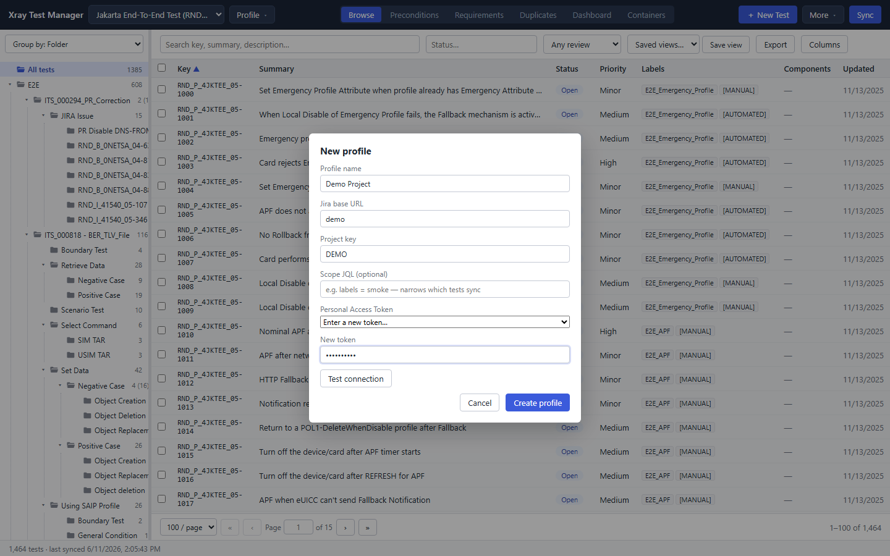
*Figure 1 — First launch: the app asks you to connect a Jira project.*

---

## 2. Connecting to Jira (profiles)

A **profile** stores how to reach one Jira project: a name, the Jira base URL,
the project key, and a **Personal Access Token (PAT)**. You can keep several
profiles and switch between them from the top bar.

To create one, fill in the connection form:

- **Name** — any label, e.g. "Payments — Prod".
- **Jira URL** — your Jira Data Center base URL, e.g. `https://jira.example.com`.
- **Project key** — the Xray test project, e.g. `QA`.
- **Personal Access Token** — created in Jira under *Profile → Personal Access
  Tokens*. Requires Jira DC 8.14+.

*Figure 2 — Creating a profile. The token is stored in the Windows Credential
Manager, never in the local database or logs.*

> **Security:** your PAT is saved to the **Windows Credential Manager** only. It
> is never written to the local database, exported profile files, or logs.

### Demo mode — try it without Jira

To explore the app with realistic data and **no Jira connection**, create a
profile with the **Jira URL set to `demo`** (any project key and any token will
do). The app then serves ~5,000 generated tests plus sample Test Sets, Plans,
Executions, folders, preconditions, and requirements entirely offline. A yellow
**`DEMO`** chip appears in the top bar. This is the recommended way to capture
the screenshots for this guide.

---

## 3. The main window

After connecting, the main window appears. It has four regions:

1. **Top bar** — profile selector and menu (left), view tabs (center), and
   pending/New Test/More/Sync actions (right).
2. **View tabs** — switch between Browse, Preconditions, Requirements,
   Duplicates, Dashboard, and Containers.
3. **Work area** — the content of the selected view.
4. **Status bar** — sync progress and the test count / last-sync time.

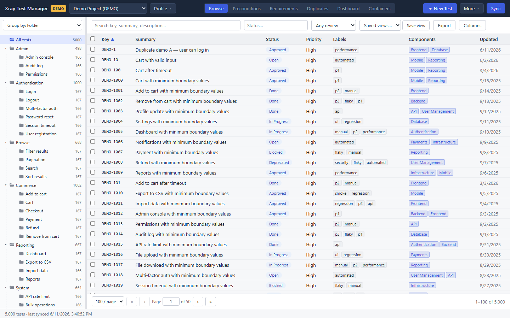
*Figure 3 — The main window (Browse view) with the four regions labeled.*

The top bar holds the most-used controls:

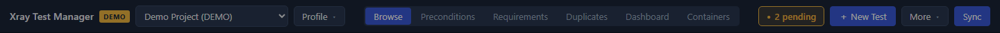
*Figure 4 — Top bar: profile selector, **Profile** menu, view tabs, the
**pending changes** badge, **New Test**, the **More** menu, and **Sync**.*

> On a narrow window the view tabs move onto their own centered row so they never
> overlap the profile controls.

---

## 4. Browsing tests

The **Browse** tab is the primary workspace: a grouping sidebar on the left, the
test grid in the middle, and a detail panel that opens on the right when you
select a test.

### Grouping sidebar

Use **Group by** to organize the left sidebar by **Folder** (the Test Repository
tree), **Test Set**, **Test Plan**, or **Component**. Selecting an entry filters
the grid to that group. Drag the divider on the sidebar's right edge to resize
it; the width is remembered.

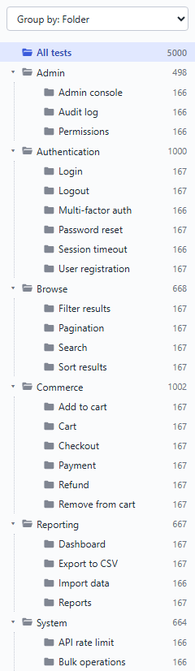
*Figure 5 — The **Group by** selector and (here) the Test Repository folder
tree. Hover a folder for New-subfolder, rename, delete, and New-test actions.*

### The test grid

The grid lists tests with sortable columns. Above it sits the toolbar:

- **Search** — matches key, summary, and description.
- **Status filter** — filter by workflow status.
- **Review filter** — Any / Approved / Rejected / Pending / Unreviewed.
- **Saved views** — apply a saved filter; **Save view** stores the current
  filter + status + review combination for reuse.
- **Export** — write the *currently filtered* tests to CSV or XLSX.
- **Columns** — show, hide, and reorder columns (the layout is remembered).

Pagination controls sit at the bottom: rows-per-page, first/prev/next/last, and
a jump-to-page box. A dirty-dot marks rows with uncommitted edits.

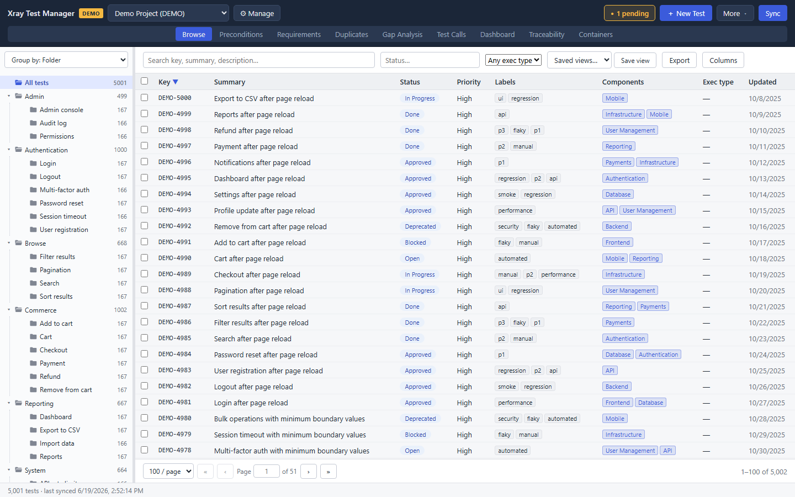
*Figure 6 — The test grid with the search box, status/review filters, Saved
views, Export, and Columns controls.*

To act on many tests at once, tick their checkboxes — or use **Select all
matching this filter** to select every test the current filter returns, across
all pages. See [Bulk operations](#7-bulk-operations).

*Figure 7 — The **Columns** panel: toggle visibility and reorder with the
up/down controls.*

---

## 5. Viewing & editing a test

Click a row to open the **detail panel** on the right. Edits here are **local
only** — they are queued as pending changes and pushed to Jira when you commit.
A dot marks each field that has an uncommitted edit.

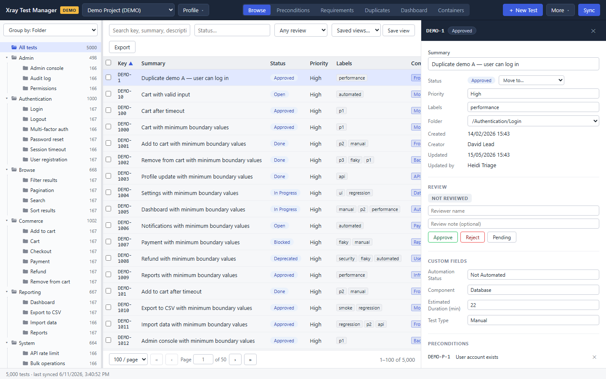
*Figure 8 — The detail panel: summary, status, priority, labels, components, and
other fields. Click a field to edit it inline.*

### Steps

Test steps load when you first open a test (to keep sync fast). You can add,
edit, reorder, and remove steps; each has Action, Data, and Expected Result, and
all three fields support **markdown** (here and in the New Test panel).

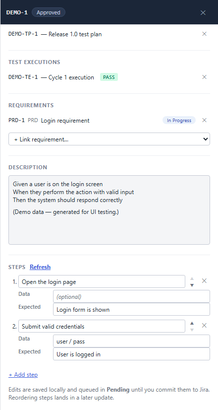
*Figure 9 — Editing the step table: action / data / expected result, with
add, reorder, and delete.*

You can also **clone steps from another test**. The **Clone from…** action — in
the Steps header here, and in the **New Test** panel — opens a picker: choose a
source test, then tick which of its steps to copy (all by default, or a subset).
The chosen steps are appended and queued as pending like any manual edit. Handy
for seeding a test from a similar existing one.

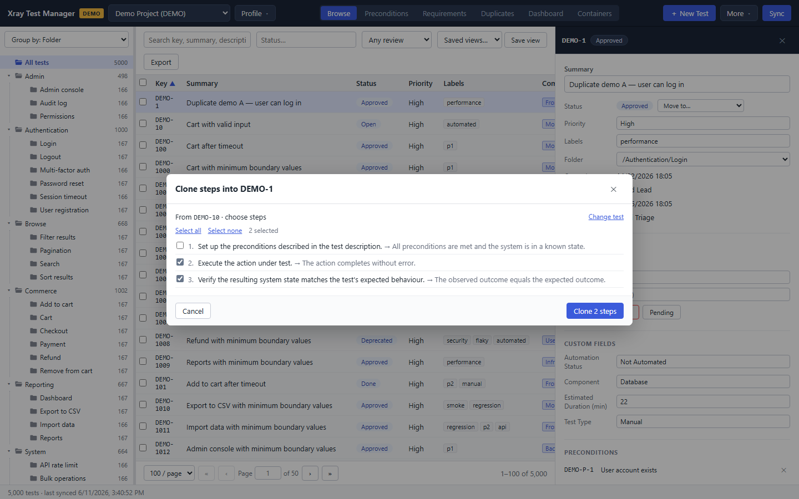
*Figure 36 — "Clone from…": after picking a source test, select which steps to
copy (whole or selective) before appending them.*

### Calling another test (test calls)

Instead of manual Action / Data / Expected content, a step can **call another
test** — Xray's "test call". In the Steps header click **+ Call test**, search
for and pick the test to call, and the step is appended as **⮡ Calls KEY**. Call
steps reorder, delete, and commit like any other step.

> The live Xray API for creating a call step is still being verified against a
> real instance; in demo mode it works end to end.

The **Test Calls** tab gives a project-wide view of these relationships:

- callers are grouped with the tests they call;
- caller rows in the Browse grid show a **⮡ calls** badge;
- a call whose target isn't in the local cache is flagged **missing**
  (deleted, never synced, or in another project);
- when tests call each other in a loop, every test in the cycle is flagged
  **cycle** (a cyclic call would recurse forever when executed);
- use **Expand all / Collapse all** and the pager when there are many callers.

### Custom fields

Xray and project custom fields also load on first open and can be edited inline.

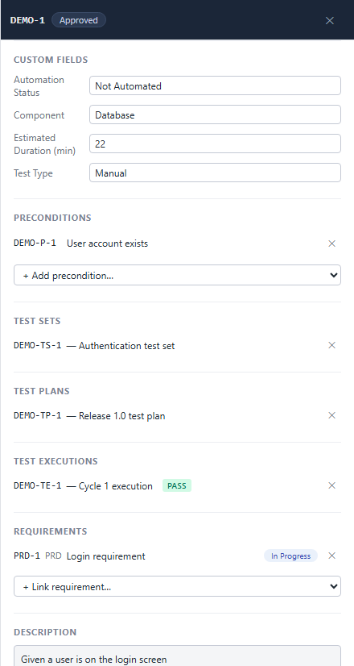
*Figure 10 — Custom-field values in the detail panel.*

### Preconditions & requirements on a test

The detail panel also shows the **preconditions** the test depends on and the
**requirements** it covers, with controls to link or unlink them.

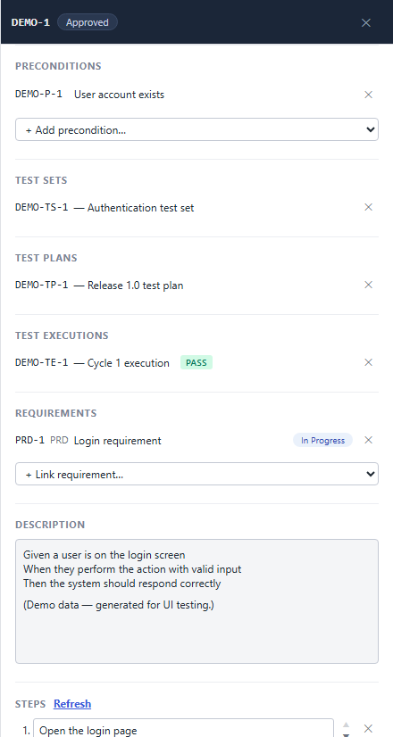
*Figure 11 — The preconditions and requirement-coverage sections of a test.*

### Workflow transitions & review

Move a test through its workflow with a transition control, and record a review
verdict (Approved / Rejected / Pending) from the detail panel. Both are queued
for commit like any other edit.

---

## 6. Creating & importing tests

### New Test

Click **New Test** (top-right, Browse view). The New Test panel collects the
summary, folder, steps, and fields. The new test gets a temporary key locally
and is created in Jira on the next commit.

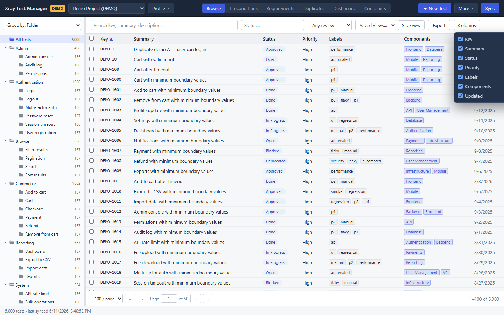
*Figure 12 — Creating a test. If a folder is selected in the sidebar it is
pre-filled.*

### Import from CSV / XLSX

To bulk-create tests from a spreadsheet, open **More → Import tests…**. Map your
columns to test fields and import; the rows are queued as new tests for commit.

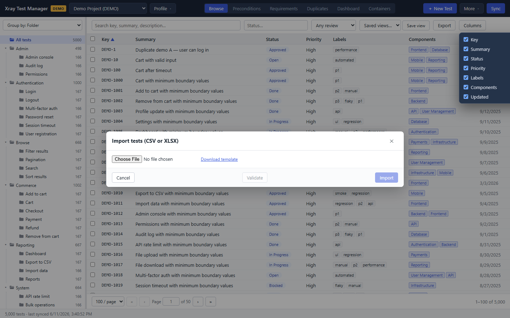
*Figure 13 — Importing tests from CSV or XLSX with column mapping.*

---

## 7. Bulk operations

Select two or more tests (checkboxes, or **Select all matching**) and the **bulk
toolbar** appears above the grid:

- **Bulk edit…** — set a field across all selected tests.
- **Bulk transition…** — move all selected tests through a workflow transition.
- **Allocate…** — add the selected tests to a Test Set / Plan / Execution.
- **Move to folder…** — re-file into a Test Repository folder.
- **Preconditions…** — link or unlink preconditions in bulk.
- **Requirements…** — link or unlink requirement coverage in bulk.
- **Review…** — apply a review verdict to all selected.

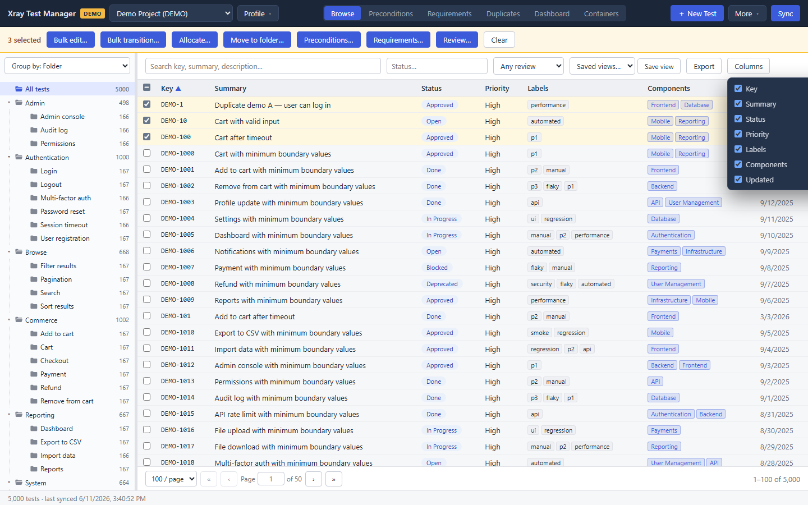
*Figure 14 — The bulk toolbar after selecting several tests.*

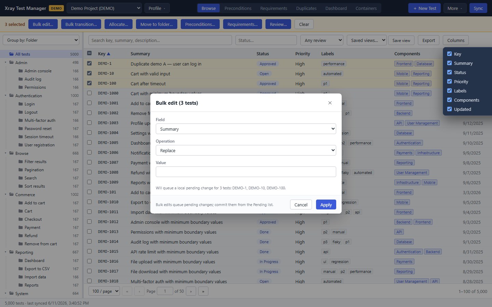
*Figure 15 — Example: the Bulk edit dialog. Every bulk action queues pending
changes rather than writing straight to Jira.*

---

## 8. Preconditions

The **Preconditions** tab is a dedicated surface for managing Xray
Preconditions. The left side is a filterable **card list**; selecting a card
opens its detail on the right.

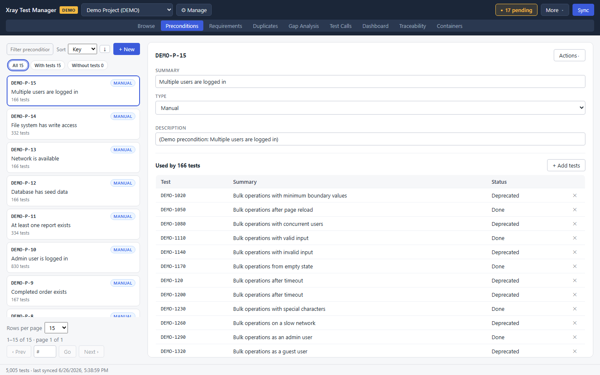
*Figure 16 — Preconditions: card list (left) with a detail pane (right) for the
summary, type, description, and the tests that use it.*

In the detail pane you can:

- Edit the **summary**, **type** (Manual / Generic / Cucumber), and
  **description** (markdown-aware).
- See and paginate the **tests that use** the precondition, and unlink any.
- **+ Add tests** to link more tests.
- Delete the precondition (queued for commit).

Create a new precondition with **+ New**:

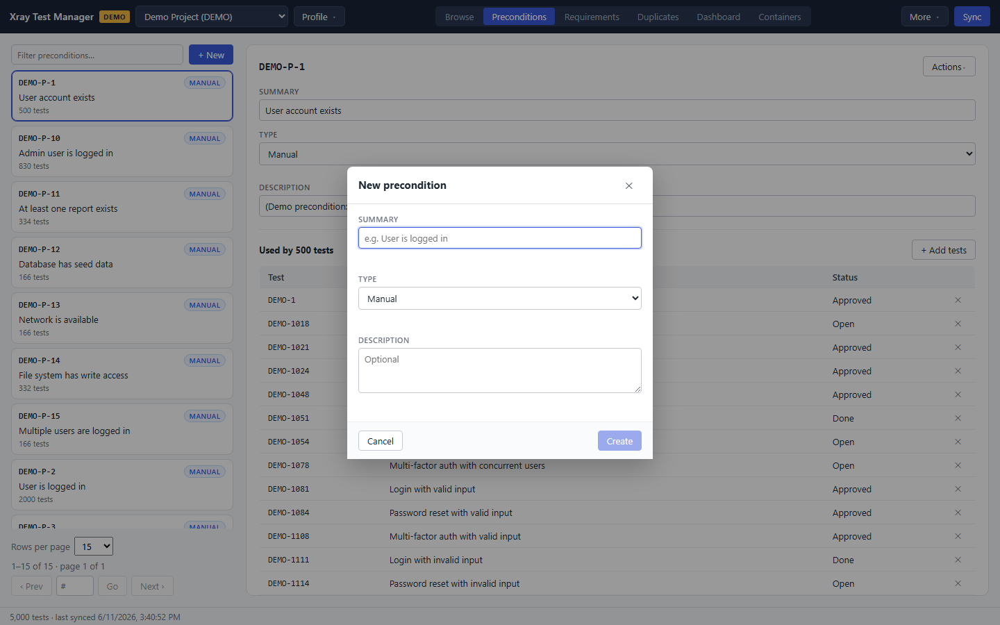
*Figure 17 — Creating a precondition. It is created in Jira on the next commit.*

---

## 9. Requirements & coverage

The **Requirements** tab shows requirements (e.g. Stories/Epics, possibly from a
different project) and their **derived coverage status** from the tests that
cover them.

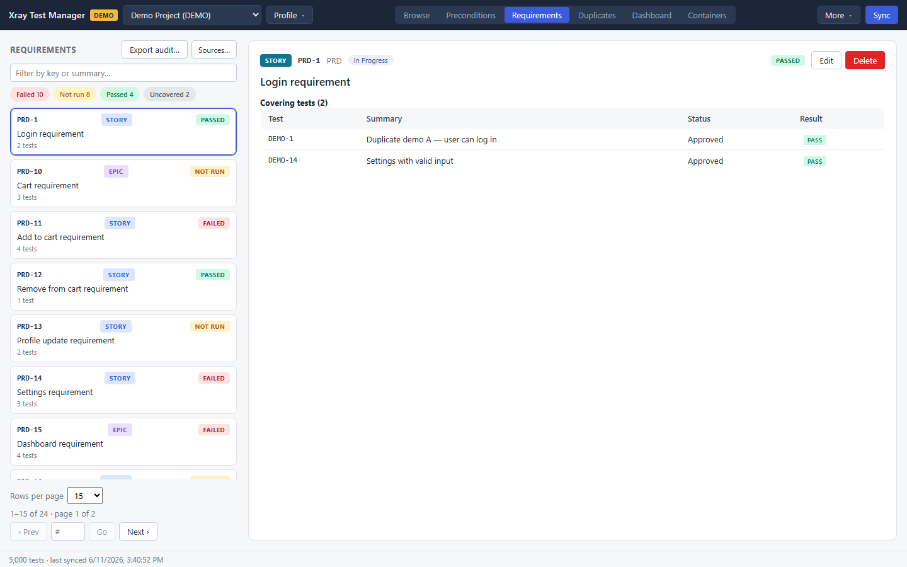
*Figure 18 — Requirements: a card list with coverage badges and filter pills
(Failed / Not run / Passed / Uncovered), and a detail pane listing the covering
tests with their run results.*

- **Coverage pills** at the top filter the list by status; the count on each
  pill updates live.
- Each card shows the requirement key, issue type, summary, coverage badge, and
  test count.
- The detail pane lists the **covering tests** (paginated) with run results, and
  lets you edit the summary or delete the requirement.
- **Export audit…** writes the coverage / sign-off audit to CSV or XLSX.

### Requirement sources

Requirements can come from projects other than your test project. Configure
which projects and issue types are pulled with **Sources…**:

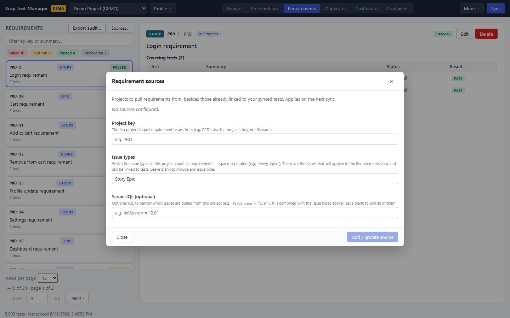
*Figure 19 — The Requirement Sources dialog: add a source project, the issue
types to include, and an optional scope. Sync afterward to pull them in.*

---

## 10. Finding duplicates

The **Duplicates** tab surfaces likely-duplicate tests so you can consolidate
them. Results are grouped; each group lists its members with a detail panel.

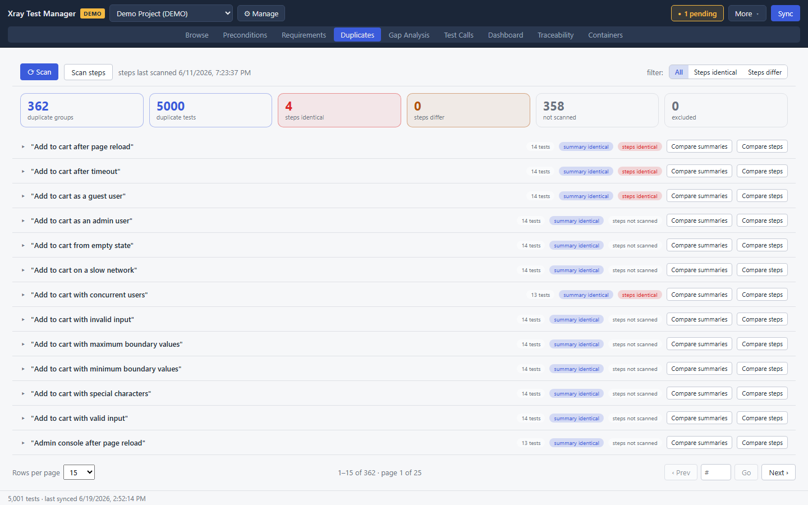
*Figure 20 — Duplicate groups with a paginated list and a balanced detail panel
for the selected group.*

Use **Compare steps** to see members' steps **side by side**, with differing
rows highlighted — useful when deciding which copy to keep.

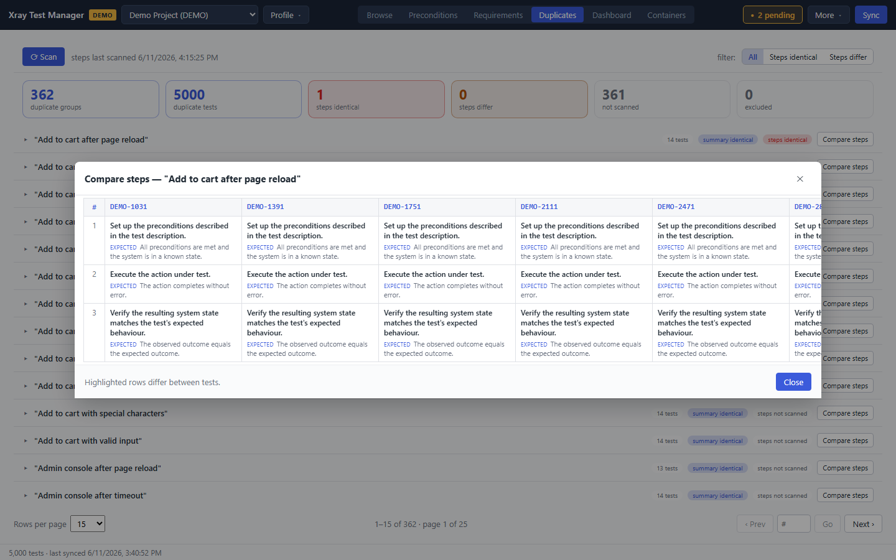
*Figure 21 — Side-by-side step comparison across the duplicated tests.*

---

## 11. Test Sets, Plans & Executions (Containers)

The **Containers** tab manages the three Xray container types. Pick a **kind**
(Test Set / Test Plan / Test Execution) and a container to see its member tests.

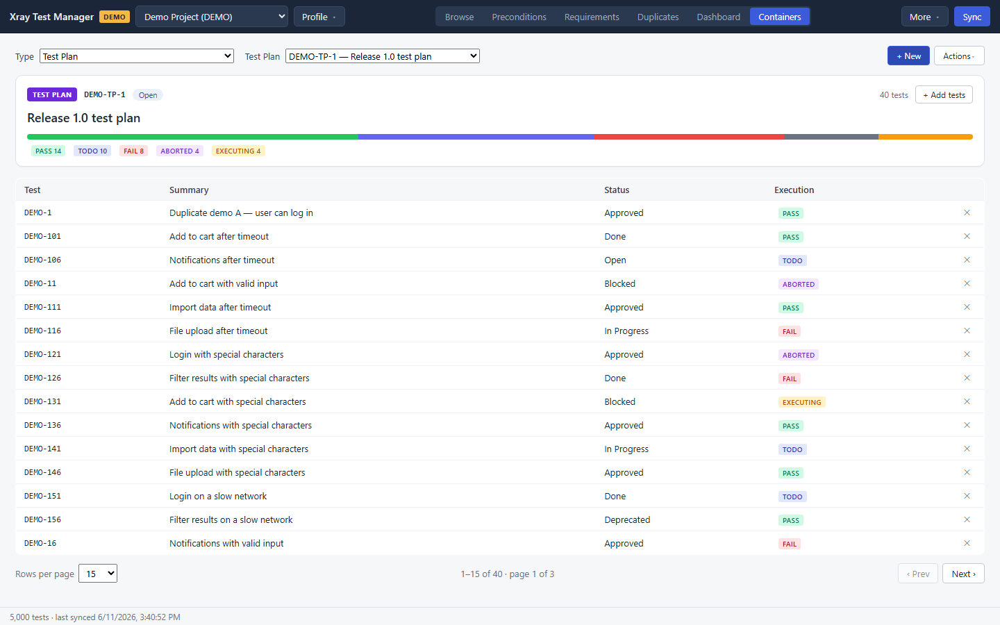
*Figure 22 — The Containers view: kind selector, container list, and member
tests. Tables default to 15 rows per page.*

You can:

- **Create** a container and allocate tests to it.
- Add or remove member tests.
- For a **Test Execution**, set each member's **run result** inline (e.g. PASS /
  FAIL / TODO), or apply one result to many selected members at once. A compact
  bar summarizes the run-status mix.

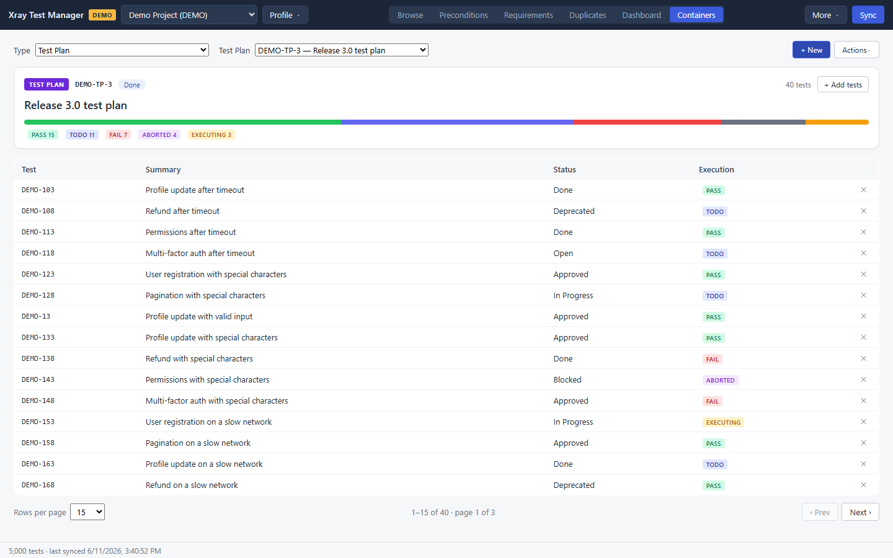
*Figure 23 — Each member's run result shows in the Execution column (PASS /
FAIL / TODO / ABORTED / EXECUTING), summarized by the bar above. In a Test
Execution these are editable inline, and one result can be applied to many
selected tests at once.*

### Generate a pytest scaffold

From a Test Plan or Execution you can generate a **pytest** scaffold for its
tests — either plain `@pytest.mark.xray` functions or a `unittest`-style class.

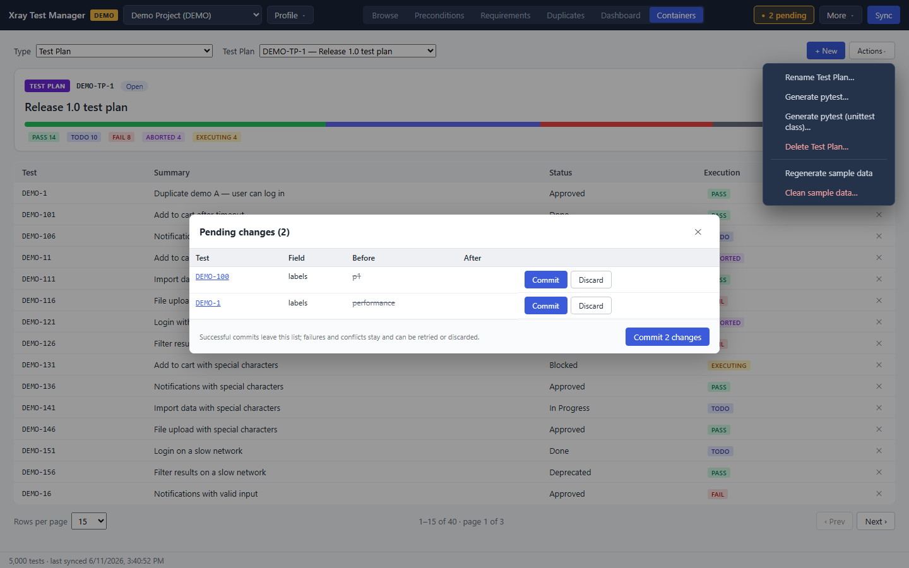
*Figure 24 — The Generate pytest menu and the resulting scaffold file.*

---

## 12. Dashboard & traceability

The **Dashboard** tab summarizes the cached project: totals, status and review
breakdowns, coverage, and two **traceability Sankey** diagrams.

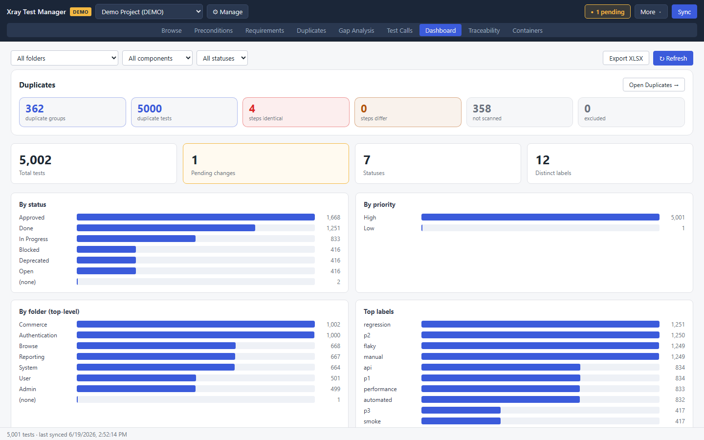
*Figure 25 — The statistics dashboard with summary cards and breakdowns.*

### Requirement traceability Sankey

This diagram flows **Requirement → Coverage → Test plan → Test result**. With
**All requirements** selected, every requirement is its own node in the first
column; the requirements filter is **multi-select** — tick one or several to
narrow the flow. Hover any node to trace its threads.

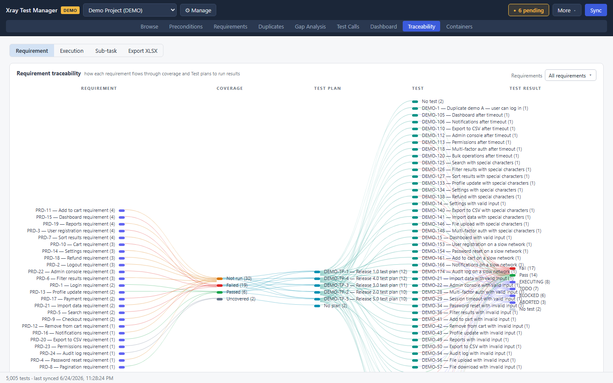
*Figure 26 — Requirement traceability: requirement → coverage → Test plan → run
result, with the requirement filter.*

### Execution traceability Sankey

A second diagram flows **Test Plan → Test Execution → run status**. The plan and
execution filters are **multi-select**, and a **Cross-project only** toggle keeps
just the runs whose Test Execution lives in a *different* Jira project than the
current profile — useful when a plan in one project is executed on another
project's board. (Those cross-project executions are pulled in during sync.)

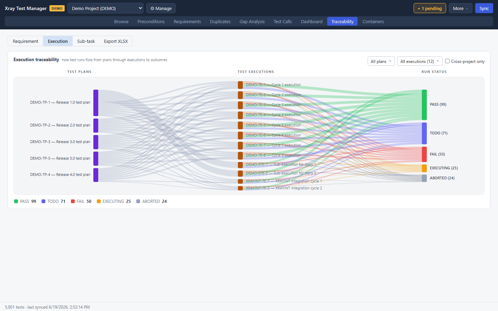
*Figure 27 — Plan → Execution → status traceability.*

---

## 13. Committing changes to Jira

All edits — field changes, steps, transitions, reviews, links, new entities,
deletions — are queued locally as **pending changes**. Nothing reaches Jira
until you commit.

The **pending badge** in the top bar shows the count. Click it to review:

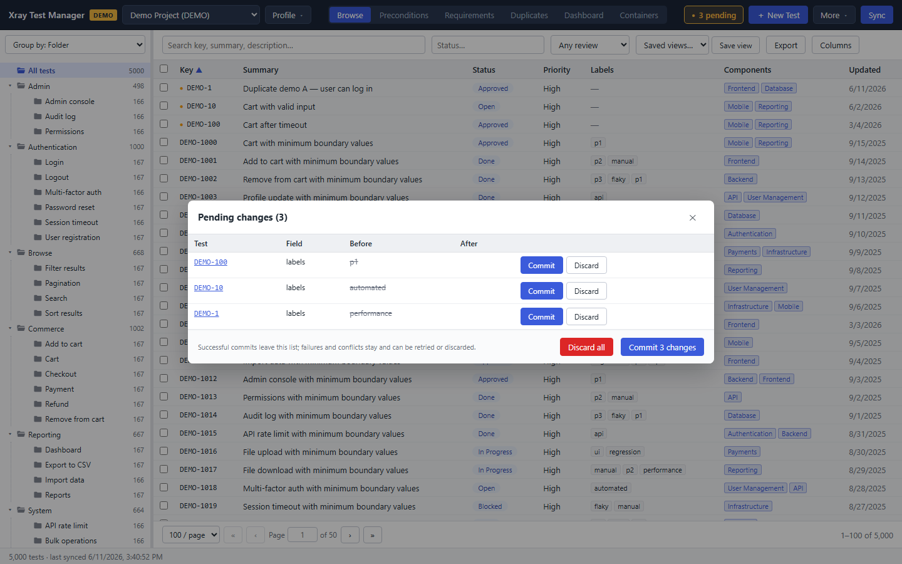
*Figure 28 — The Pending Changes dialog: review each queued edit, discard
individual ones (or **Discard all** to revert everything), jump to the affected
test, **Commit** everything, or commit a selected subset.*

On **Commit**, the app pushes changes to Jira grouped by test. Results are
reported per test:

- **Succeeded** — applied; the pending rows are cleared.
- **Failed** — kept so you can retry or discard.
- **Conflict** — the test changed in Jira since your edit was based on it. The
  test is held back so you can **sync**, then either **override** (re-base your
  edit onto the latest remote) or **keep remote** (discard your local edit).
  Conflicts surface in this same dialog with the override / keep-remote actions.

---

## 14. Syncing

**Sync** pulls the latest tests from Jira into the local cache. The status bar
shows progress per phase (tests, folders, preconditions, containers, custom
fields).

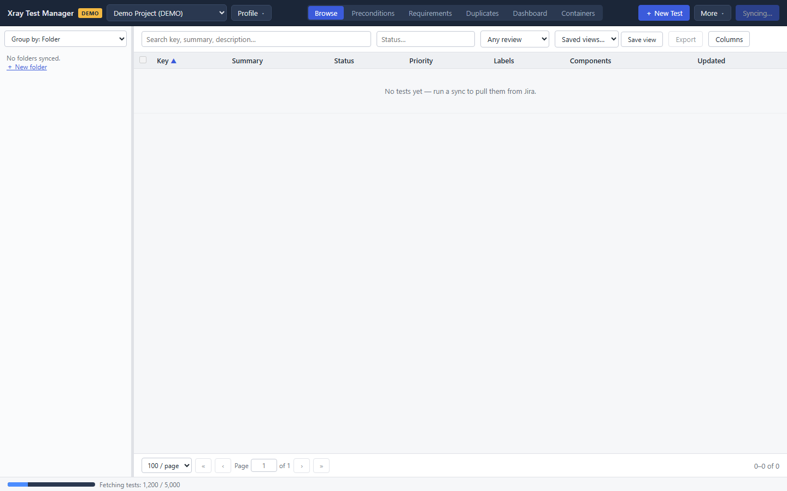
*Figure 30 — A sync in progress, with the phase and item counts in the status
bar.*

- **Sync** (top-right) — incremental pull since the last watermark.
- **More → Full resync (re-pull folders)** — ignores the watermark and re-maps
  Test Repository folder membership. Slower; use after big folder reshuffles.
- **More → Sync history** — past syncs with timing and counts.

**Per-view refresh.** You don't always need a full sync. Some views refresh just
their own data:

- **Requirements → Sync** — pulls only requirement coverage from Jira.
- **Containers → Sync** — pulls only Test Sets / Plans / Executions.
- **Dashboard → Refresh** — recomputes the dashboard from the local cache.
- **Duplicates → Scan** — re-scans the cache for duplicates.

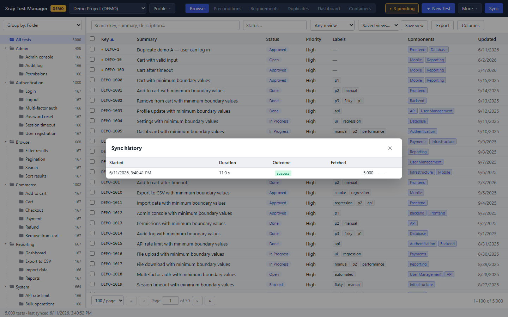
*Figure 31 — The paginated sync history.*

---

## 15. Settings & profile management

The **Profile** menu (top-left) manages the active profile:

- **Set as default** — auto-select this profile at launch.
- **Edit profile…** — name, URL, project key, scope.
- **Set scope…** — a JQL scope that narrows which tests sync (blank = all).
- **Set token…** — set or rotate the PAT.
- **Export profile…** / **Import profile…** — share a profile's config (without
  its token).
- **New profile…**

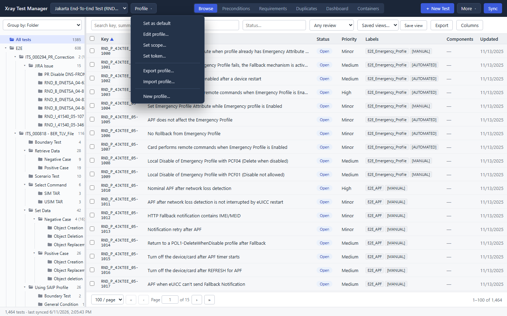
*Figure 32 — The Profile menu.*

Switch the **color theme** from **More → Theme: Light / Dark / System**.

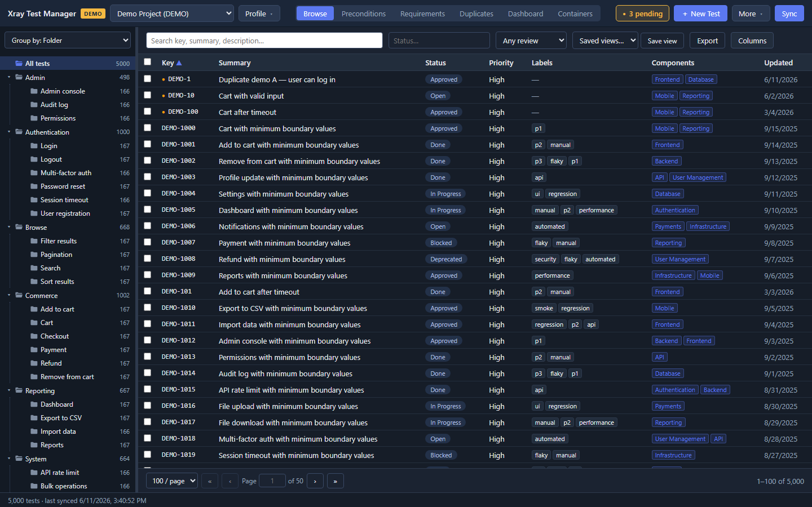
*Figure 33 — The app in dark theme.*

---

## 16. Diagnostics & troubleshooting

**More → Diagnostics** shows the database path, log path, schema version, and
environment details — useful when reporting an issue.

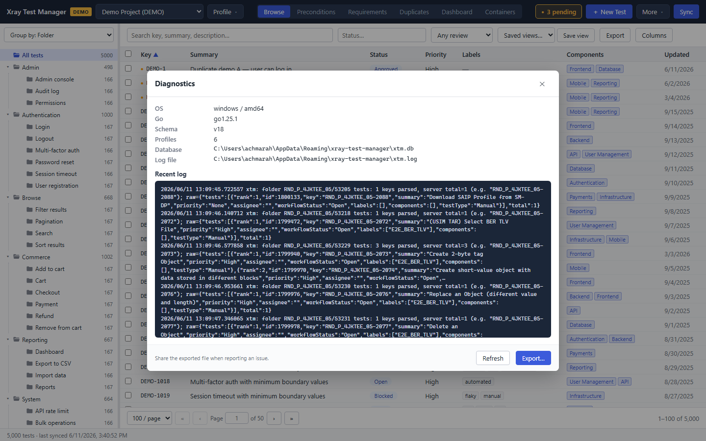
*Figure 34 — The Diagnostics dialog.*

| Symptom | What to try |
| --- | --- |
| Blank window on launch | Install the Microsoft WebView2 runtime, relaunch. |
| "Backend failed to start" | Note the DB/log path shown, check the log; try removing the database file and relaunching. |
| Sync shows 0 tests | Check the project key and that the PAT has access; confirm the scope JQL isn't excluding everything. |
| Edits not in Jira | They are local until you **Commit** (see §13). Check the pending badge. |
| A commit reports **Conflict** | Sync, then override or keep-remote in the Pending Changes dialog. |
| Token rejected | Rotate it with **Profile → Set token…**. |

**About** (native menu / **More**) shows the version.

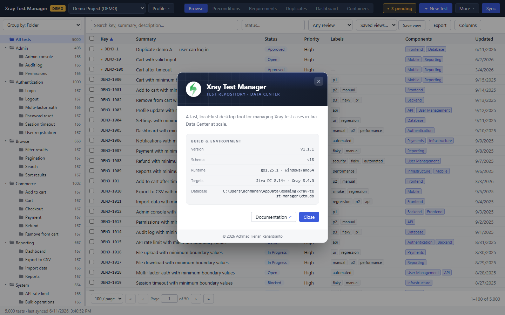
*Figure 35 — The About dialog with the version number.*

---

## Glossary

- **PAT** — Personal Access Token; how the app authenticates to Jira DC.
- **Pending change** — a local edit queued in the app, not yet in Jira.
- **Commit** — push all (or selected) pending changes to Jira.
- **Sync** — pull the latest from Jira into the local cache.
- **Coverage** — a requirement's status derived from its covering tests' results
  (Passed / Failed / Not run / Uncovered).
- **Container** — a Test Set, Test Plan, or Test Execution.
- **Run result** — a test's status within a Test Execution (e.g. PASS/FAIL/TODO).
- **Demo profile** — a profile with Jira URL `demo`; runs fully offline on
  generated data.

---

*This guide is distributed with Xray Test Manager. Screenshots are captured from
a demo profile; your data and exact field set may differ by Jira/Xray
configuration.*
