# Xray Test Manager — User Guide

**Version:** 1.9.0 · **Platform:** Windows 10/11 (64-bit) · **Audience:** QA engineers,
test leads, and anyone managing Xray test cases in Jira Data Center.

Xray Test Manager is a lightweight Windows desktop app for managing **Xray test
cases in Jira Data Center** at scale (10k+ test cases). It keeps a fast local
copy of your tests so browsing, searching, filtering, and bulk editing are
instant — then pushes your edits back to Jira when you choose to commit. **Jira
is always the system of record;** the app never changes anything in Jira until
you commit.

> **About the screenshots in this guide.** Figures are referenced from the
> `images/` folder next to this file. If a figure is blank, the screenshot has
> not been captured yet — see the [Screenshot capture guide](#screenshot-capture-guide) appendix for the exact
> view and state to capture for each one. The fastest way to produce every
> screenshot is to run the app against a **demo profile** (no Jira required —
> see [Demo mode](#demo-mode-try-it-without-jira)).

---

## What's new in 1.9.0

Version 1.9.0 is a major feature release. Highlights:

- **Backend-agnostic core + Kiwi TCMS.** The local store is now a neutral hub
  that can pull from and publish to more than one backend. **Kiwi TCMS** is the
  first non-Xray target, with a **migration bridge** to move a dataset between
  connections. Each backend advertises its capabilities and the UI hides what a
  backend cannot do — Xray keeps every feature unchanged.
- **Publish coverage groups to Xray.** From the Coverage module you can publish a
  coverage group to Xray as a **Test Set**, with **drift detection** when the
  published set diverges from the local group.
- **Cross-project linking.** The precondition, call-test, and clone-steps pickers
  can reach tests and preconditions in other projects you configure as
  cross-project sources.
- **Test Calls: cross-project vs missing.** An unresolved call is now split into
  **cross-project** (the target lives in another project — expected) and
  **missing** (deleted or not synced), each clearly labelled. See
  [Calling another test](#calling-another-test-test-calls).
- **Misspellings view.** Scan every test case for spelling errors and jump to the
  offending test.
- **Duplicate preconditions.** The Duplicates feature now detects preconditions
  with matching content, not just tests.
- **Cucumber and Generic test types**, and the ability to **link an existing bug**
  and add **remarks** on a Test Execution run.
- **Faster sync** (container sync is concurrent and rate-limited) with a **bug-sync
  progress bar**, plus container, import, and Manage Profiles refinements.

---

## What's new in 1.8.0

Version 1.8.0 is a major feature release. Highlights:

- **Requirements suite.** Create, import, and link requirements, edit their full
  detail (priority, components, fix versions, sprint, and a markdown
  description), and choose which Jira link type connects Tests to Requirements.
  See [Requirements & coverage](#requirements-coverage).
- **Coverage module (opt-in).** A new **Coverage** tab measures parameter-level
  test coverage and lets you define a functional requirement once and reuse it
  across customer projects, with per-version coverage, change requests, and a
  visual Coverage Map. Enable it from **More → Show Coverage tab**. See
  [Coverage module](#coverage-module).
- **Preconditions** gain a dedicated **Condition** field and a read-only detail
  with explicit Edit, Save, and Cancel.
- **Dashboard** adds a **By requirement** breakdown beside By component.
- **Traceability** adds an **Epic** layer to the requirement flow.
- **Gap Analysis** and the profile switcher got UI polish, and profile switching
  is now locked while a sync runs.

---

## What's new in 1.7.0a (alpha)

- **Test run history.** Each test now has a **Run history** section: every
  execution it ran in, with the result, date, who ran it, environment, Test
  Plan(s), Fix Version(s), and linked defects. Test Executions gain run date /
  tester / environment columns, and Test Plans / Sets show a run roll-up. See
  [Run history](#run-history) and [Containers](#test-sets-plans-executions-containers).
- **View sessions.** Switching tabs no longer resets a view: your selection,
  filters, search, pagination, and sub-tab are restored when you return to it
  (until you restart the app or change profile).
- **Richer bug detail.** A bug's affected-tests table gains a **Project** column
  and an expandable per-test breakdown (fix version / execution / plan /
  environment / date / tester / defects). From there you can open a test's
  **read-only detail** in a side panel without leaving the Bugs view, or add the
  bug's tests to an **existing** Test Execution. See
  [Defect tracking](#defect-tracking).
- **Read-only detail side panels.** The read-only test detail also opens beside
  the Test Execution member list in Containers, and the same side-panel layout is
  used from the **Requirements** view's covering-tests table (it no longer takes
  over the whole screen). See [Requirements & coverage](#requirements-coverage).
- **Import JUnit XML results.** Update a Test Execution's run results by importing
  a JUnit-compatible report, matching each `<testcase name>` to a test by summary.
  Import into the **selected execution**, or **create a new execution** from the
  report (optionally creating any tests it does not find). See
  [Containers](#test-sets-plans-executions-containers).
- **Per-test Fix Version on executions.** Each member of a Test Execution shows
  its **own** Jira Fix Version(s) in a column, and the execution's Fix Version
  chips are clickable to filter the member list. See
  [Containers](#test-sets-plans-executions-containers).
- **Run history nested by Test Plan, sortable.** A bug's per-test run breakdown
  groups runs under each **Test Plan** (a plan can span several executions and fix
  versions), adds **Created / Updated** timestamps, and the run rows sort by them.
  See [Defect tracking](#defect-tracking).
- **Traceability detail.** The Requirement flow gains a **Test** column
  (requirement → coverage → Test plan → **test** → result), and the Sub-task flow
  labels each parent with its **summary**. See [Traceability](#traceability).
- **Bugs panel polish.** A scrollable bug list with a **select-all** checkbox,
  working rows-per-page (default 5), and full-colour run-status highlighting.
- **macOS fixes.** Copy/paste and right-click now work in text inputs (a standard
  Edit menu is wired in); a profile can supply a **custom CA certificate** or
  **allow an untrusted certificate** to connect through an internal CA; and the
  Personal Access Token field has a **show/hide** toggle. You can also **test the
  connection while editing** a saved profile (it uses the stored token). See
  [Connecting to Jira](#connecting-to-jira-profiles).

> This is an **alpha** build (`1.7.0a`) for validation. The live Xray run data
> and the macOS TLS / menu fixes still need verifying against a real instance.

## What's new in 1.6.0

- **Test Case Gap Analysis.** A new **Gap Analysis** tab compares a project (or
  an imported CSV/XLSX list) against a target list and reports what is missing on
  each side, with an optional folder-mismatch check, create-tests-from-gaps, and
  a formatted Excel report. See [Gap analysis](#gap-analysis).
- **Cross-project Test Executions.** Member tests that live in a *different* Jira
  project now appear on the execution board and in the traceability flow (with an
  **include cross-project members** toggle), and their linked bugs are harvested.
  See [Containers](#test-sets-plans-executions-containers) and
  [Traceability](#traceability).
- **Execution Type.** The Xray **Test Type** (Manual / Automated / Generic /
  Cucumber) is now a Browse column and filter, and is editable per test and in
  bulk. See [Browsing tests](#browsing-tests).
- **Test Environments & Fix Version(s) on executions.** A Test Execution shows
  its **Test Environments** (editable, single and bulk) and its read-only Jira
  **Fix Version(s)**. See [Containers](#test-sets-plans-executions-containers).
- **Swap and multi-pick links.** Add several requirements or preconditions to a
  test at once, or **Replace** (swap) the whole set in one step — per test and in
  bulk. See [Bulk operations](#bulk-operations).
- **Add tests to a requirement.** Link covering tests straight from the
  Requirements view. See [Requirements & coverage](#requirements-coverage).
- **Export to XLSX everywhere.** Export the **Dashboard** and the active
  **Traceability** tab to Excel, on top of the existing CSV/XLSX exports, and
  filter the Dashboard by folder / component / status.
- **Duplicates: compare summaries.** Compare duplicate members' summaries side by
  side (in addition to steps), with a scan progress bar. See
  [Finding duplicates](#finding-duplicates).
- **Live Jira/Xray wiring.** Every operation now runs against a live Jira Data
  Center / Xray Server instance, not just demo data (see the note below).

> **Live wiring (Phase 7).** The real Jira/Xray REST calls are now implemented
> for every operation. A few instance-specific shapes are still being verified
> against live servers; demo mode remains fully functional throughout.

## What's new in 1.5.0

- **Defect tracking.** Raise a bug straight from a failed test in a Test
  Execution, browse every bug linked to your tests in a new **Bugs** panel, and
  see a test's linked bugs — including ones filed in other projects — on its
  detail panel. See [Defect tracking](#defect-tracking).
- **Sub-task Test Executions.** Xray sub-task Test Executions (an execution that
  is a sub-task of a parent issue) now sync and sit alongside standalone ones —
  filter by Standalone or Sub-task and open the parent issue from the container
  card. See [Containers](#test-sets-plans-executions-containers).
- **Traceability view.** The traceability Sankeys moved out of the Dashboard
  into their own **Traceability** tab with three diagrams — Requirement,
  Execution, and the new **Sub-task** (parent → execution → result). See
  [Traceability](#traceability).
- **Searchable, filterable lists.** Type-to-filter dropdowns and sort/filter
  controls on the Requirements, Preconditions and Bugs panels and the container
  picker (filter executions by Standalone / Sub-task too).
- **Jira colour in text.** `{color:#hex}…{color}` macros in descriptions and
  steps now render in colour; editing still shows the raw macro so it
  round-trips back to Jira unchanged.
- **Editing niceties.** Duplicate a step, clone a whole test, native spell-check
  on test prose, and the test key in the detail header links to its Jira issue.
- **Smarter sync.** Per-view syncs (Containers, Requirements, Bugs) now show
  progress in the status bar; bug sync respects the profile scope.

Earlier releases added commit **conflict management** (three-way merge),
**macOS** support, and the **Test Calls** view (1.3.0–1.4.0). See
[`CHANGELOG.md`](../../CHANGELOG.md) for the full history.

---

## Contents

1. [Installation & first launch](#installation-first-launch)
2. [Connecting to Jira (profiles)](#connecting-to-jira-profiles)
3. [Demo mode — try it without Jira](#demo-mode-try-it-without-jira)
4. [The main window](#the-main-window)
5. [Browsing tests](#browsing-tests)
6. [Viewing & editing a test](#viewing-editing-a-test)
7. [Creating & importing tests](#creating-importing-tests)
8. [Bulk operations](#bulk-operations)
9. [Preconditions](#preconditions)
10. [Requirements & coverage](#requirements-coverage)
11. [Finding duplicates](#finding-duplicates)
12. [Test Sets, Plans & Executions (Containers)](#test-sets-plans-executions-containers)
13. [Defect tracking](#defect-tracking)
14. [Dashboard](#dashboard)
15. [Traceability](#traceability)
16. [Gap analysis](#gap-analysis)
17. [Coverage module](#coverage-module)
18. [Committing changes to Jira](#committing-changes-to-jira)
19. [Syncing](#syncing)
20. [Settings & profile management](#settings-profile-management)
21. [Diagnostics & troubleshooting](#diagnostics-troubleshooting)
22. [Glossary](#glossary)

---

## 1. Installation & first launch

Xray Test Manager ships as a single Windows executable. There are two artifacts:

| Artifact | Use it when |
| --- | --- |
| `xray-test-manager-<version>-windows-amd64.exe` | **Portable.** Run it directly — no install. |
| `xray-test-manager-<version>-windows-amd64-installer.exe` | **Installer.** Adds a Start-menu entry and uninstaller. |

**Prerequisite:** Microsoft **WebView2** runtime. It is already present on
up-to-date Windows 10/11. If the window is blank on first launch, install the
"Evergreen" WebView2 runtime from Microsoft and relaunch.

On first launch the app opens the connection screen, because no profile exists
yet.

*Figure 1 — First launch: the app asks you to connect a Jira project.*

---

## 2. Connecting to Jira (profiles)

A **profile** stores how to reach one Jira project: a name, the Jira base URL,
the project key, and a **Personal Access Token (PAT)**. You can keep several
profiles and switch between them from the top bar.

To create one, fill in the connection form:

- **Name** — any label, e.g. "Payments — Prod".
- **Jira URL** — your Jira Data Center base URL, e.g. `https://jira.example.com`.
- **Project key** — the Xray test project, e.g. `QA`.
- **Personal Access Token** — created in Jira under *Profile → Personal Access
  Tokens*. Requires Jira DC 8.14+.

*Figure 2 — Creating a profile. The token is stored in the Windows Credential
Manager, never in the local database or logs.*

> **Security:** your PAT is saved to the **Windows Credential Manager** only. It
> is never written to the local database, exported profile files, or logs.

The PAT field has a **show/hide** toggle so you can reveal what you typed while
pasting or checking it.

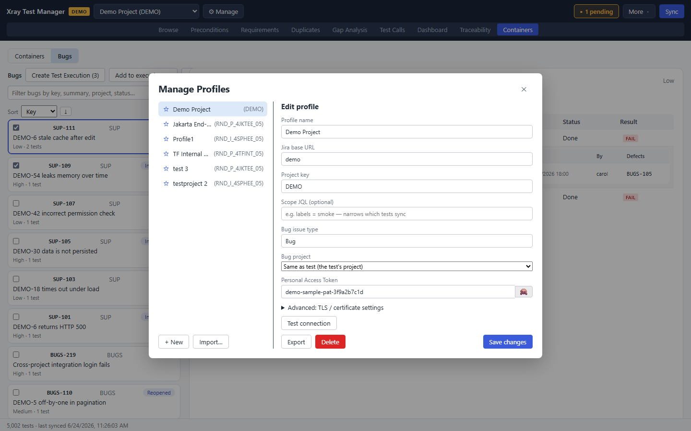
*Figure 48 — The Personal Access Token field with its show/hide toggle.*

**Advanced: TLS / certificate settings.** If your Jira uses an internal or
self-signed certificate and the connection test fails with a certificate error
(`x509: certificate signed by unknown authority`), expand **Advanced: TLS /
certificate settings** and either paste a **CA certificate (PEM)** to trust, or
tick **Allow untrusted certificate (skip TLS verification)** (insecure; only for
a trusted internal server).

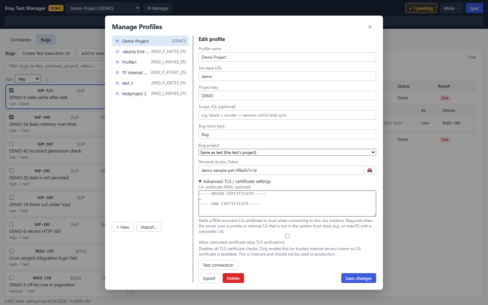
*Figure 49 — Advanced TLS settings: a custom CA certificate, or the
allow-untrusted escape hatch.*

### Demo mode — try it without Jira

To explore the app with realistic data and **no Jira connection**, create a
profile with the **Jira URL set to `demo`** (any project key and any token will
do). The app then serves ~5,000 generated tests plus sample Test Sets, Plans,
Executions, folders, preconditions, and requirements entirely offline. A yellow
**`DEMO`** chip appears in the top bar. This is the recommended way to capture
the screenshots for this guide.

---

## 3. The main window

After connecting, the main window appears. It has four regions:

1. **Top bar** — profile selector and menu (left), view tabs (center), and
   pending/New Test/More/Sync actions (right).
2. **View tabs** — switch between Browse, Preconditions, Requirements,
   Duplicates, Gap Analysis, Test Calls, Dashboard, Traceability, and Containers
   (plus an opt-in **Coverage** tab, enabled from **More → Show Coverage tab**).
3. **Work area** — the content of the selected view.
4. **Status bar** — sync progress and the test count / last-sync time.

*Figure 3 — The main window (Browse view) with the four regions labeled.*

The top bar holds the most-used controls:

*Figure 4 — Top bar: profile selector, **Profile** menu, view tabs, the
**pending changes** badge, **New Test**, the **More** menu, and **Sync**.*

> On a narrow window the view tabs move onto their own centered row so they never
> overlap the profile controls.

---

## 4. Browsing tests

The **Browse** tab is the primary workspace: a grouping sidebar on the left, the
test grid in the middle, and a detail panel that opens on the right when you
select a test.

### Grouping sidebar

Use **Group by** to organize the left sidebar by **Folder** (the Test Repository
tree), **Test Set**, **Test Plan**, or **Component**. Selecting an entry filters
the grid to that group. Drag the divider on the sidebar's right edge to resize
it; the width is remembered.

*Figure 5 — The **Group by** selector and (here) the Test Repository folder
tree. Hover a folder for New-subfolder, rename, delete, and New-test actions.*

### The test grid

The grid lists tests with sortable columns. Above it sits the toolbar:

- **Search** — matches key, summary, and description.
- **Status filter** — filter by workflow status.
- **Execution Type filter** — narrow to a Xray **Test Type** (Manual / Automated
  / Generic / Cucumber). Execution Type is also available as a sortable,
  toggleable grid column (add it from **Columns**) and is editable per test and
  in bulk.
- **Saved views** — apply a saved filter; **Save view** stores the current
  filter + status combination for reuse.
- **Export** — write the *currently filtered* tests to CSV or XLSX.
- **Columns** — show, hide, and reorder columns (the layout is remembered).

Pagination controls sit at the bottom: rows-per-page, first/prev/next/last, and
a jump-to-page box. A dirty-dot marks rows with uncommitted edits.

*Figure 6 — The test grid with the search box, status filter, Saved views,
Export, and Columns controls.*

To act on many tests at once, tick their checkboxes — or use **Select all
matching this filter** to select every test the current filter returns, across
all pages. See [Bulk operations](#bulk-operations).

*Figure 7 — The **Columns** panel: toggle visibility and reorder with the
up/down controls.*

---

## 5. Viewing & editing a test

Click a row to open the **detail panel** on the right. Edits here are **local
only** — they are queued as pending changes and pushed to Jira when you commit.
A dot marks each field that has an uncommitted edit.

*Figure 8 — The detail panel: summary, status, priority, labels, components, and
other fields. Click a field to edit it inline.*

### Steps

Test steps load when you first open a test (to keep sync fast). You can add,
edit, reorder, and remove steps; each has Action, Data, and Expected Result, and
all three fields support **markdown** (here and in the New Test panel). Jira
`{color:#hex}…{color}` macros render in colour in the read view, while editing
shows the raw macro so it round-trips back to Jira unchanged.

*Figure 9 — Editing the step table: action / data / expected result, with
add, reorder, and delete.*

You can also **clone steps from another test**. The **Clone from…** action — in
the Steps header here, and in the **New Test** panel — opens a picker: choose a
source test, then tick which of its steps to copy (all by default, or a subset).
The chosen steps are appended and queued as pending like any manual edit. Handy
for seeding a test from a similar existing one.

*Figure 36 — "Clone from…": after picking a source test, select which steps to
copy (whole or selective) before appending them.*

### Calling another test (test calls)

Instead of manual Action / Data / Expected content, a step can **call another
test** — Xray's "test call". In the Steps header click **+ Call test**, search
for and pick the test to call, and the step is appended as **⮡ Calls KEY**. Call
steps reorder, delete, and commit like any other step.

The **Test Calls** tab gives a project-wide view of these relationships:

- callers are grouped with the tests they call;
- caller rows in the Browse grid show a **⮡ calls** badge;
- a call whose target isn't in the local cache is classified as either
  **cross-project** (blue — the target lives in another Jira project, which is
  expected) or **missing** (amber — deleted in Jira or not synced yet). A legend
  explains the badges, and a note at the bottom of the view explains the
  cross-project calls and how to browse them (add the project as a cross-project
  source) or fix a mistyped key (re-sync);
- when tests call each other in a loop, every test in the cycle is flagged
  **cycle** (a cyclic call would recurse forever when executed);
- use **Expand all / Collapse all** and the pager when there are many callers.

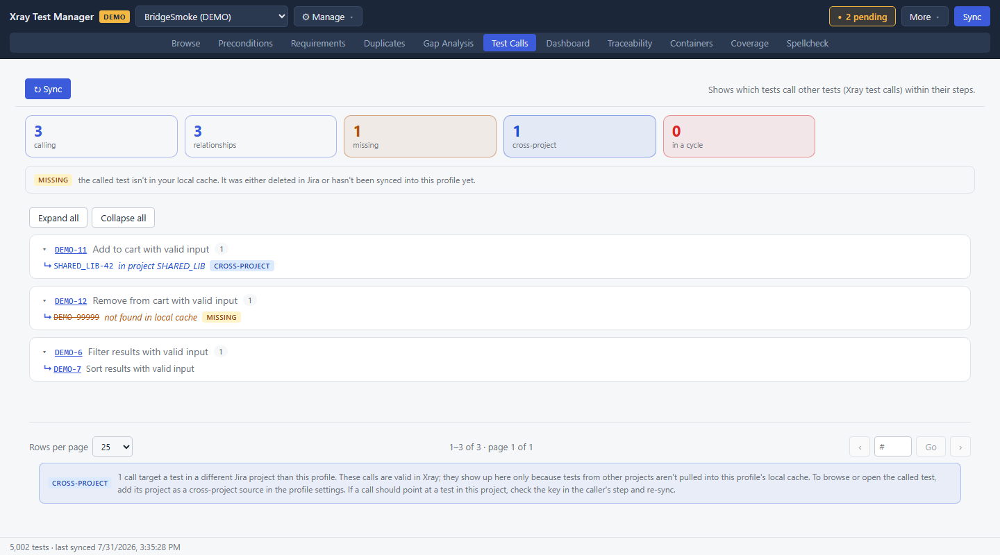
*Figure 55 — The Test Calls view: the "missing" and "cross-project" tiles, per-row
badges, and the cross-project explanation pinned at the bottom.*

### Custom fields

Xray and project custom fields also load on first open and can be edited inline.

*Figure 10 — Custom-field values in the detail panel.*

### Preconditions & requirements on a test

The detail panel also shows the **preconditions** the test depends on and the
**requirements** it covers, with controls to link or unlink them. Use the
searchable picker to **add several at once**, or **Replace** to swap the whole
set (unlink the current ones and link the chosen ones) in a single step. The same
applies in bulk — see [Bulk operations](#bulk-operations).

*Figure 11 — The preconditions and requirement-coverage sections of a test.*

### Workflow transitions

Move a test through its workflow with a transition control from the detail
panel; the transition is queued for commit like any other edit.

### Linked bugs

If a test has defects linked to it (including bugs filed in a different Jira
project), they appear in a **Linked bugs** section on the detail panel as
clickable keys that open in the browser. See [Defect tracking](#defect-tracking).

### Run history

The detail panel's **Run history** section lists every Test Execution this test
ran in, with the result, date, who ran it, environment, Test Plan(s), Fix
Version(s), and any linked defects. It is pulled from Xray during sync, so you
see a test's run trajectory without opening Xray; execution and defect keys open
in the browser.

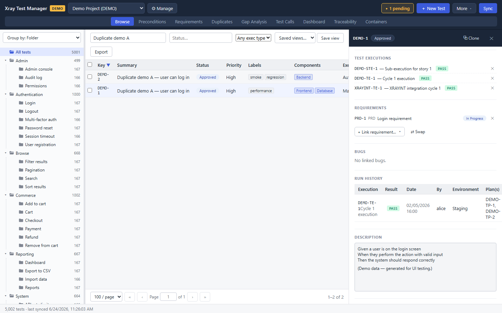
*Figure 42 — The Run history section: each execution run with result, date,
tester, environment, plan, fix versions, and defects.*

---

## 6. Creating & importing tests

### New Test

Click **New Test** (top-right, Browse view). The New Test panel collects the
summary, folder, steps, and fields. The new test gets a temporary key locally
and is created in Jira on the next commit.

*Figure 12 — Creating a test. If a folder is selected in the sidebar it is
pre-filled.*

### Import from CSV / XLSX

To bulk-create tests from a spreadsheet, open **More → Import tests…**. Map your
columns to test fields and import; the rows are queued as new tests for commit.

*Figure 13 — Importing tests from CSV or XLSX with column mapping.*

---

## 7. Bulk operations

Select two or more tests (checkboxes, or **Select all matching**) and the **bulk
toolbar** appears above the grid:

- **Bulk edit…** — set a field across all selected tests, including the
  **Execution Type** (Xray Test Type), priority, labels, components, and custom
  fields.
- **Bulk transition…** — move all selected tests through a workflow transition.
- **Allocate…** — add the selected tests to a Test Set / Plan / Execution.
- **Move to folder…** — re-file into a Test Repository folder.
- **Preconditions…** — link, unlink, or **Replace** (swap) preconditions in bulk.
- **Requirements…** — link, unlink, or **Replace** requirement coverage in bulk.

*Figure 14 — The bulk toolbar after selecting several tests.*

*Figure 15 — Example: the Bulk edit dialog. Every bulk action queues pending
changes rather than writing straight to Jira.*

---

## 8. Preconditions

The **Preconditions** tab is a dedicated surface for managing Xray
Preconditions. The left side is a filterable **card list**; selecting a card
opens its detail on the right.

*Figure 16 — Preconditions: card list (left) with a detail pane (right) for the
summary, type, description, and the tests that use it.*

The detail opens **read-only**; use **Edit**, **Save**, and **Cancel** to change
it. In edit mode you can:

- Edit the **summary**, **type** (Manual / Generic / Cucumber), the
  **description** (markdown-aware), and a dedicated **Condition** field (the
  precondition's given-state text). The Condition and Description sections are
  collapsible.
- See and paginate the **tests that use** the precondition, and unlink any.
- **+ Add tests** to link more tests.
- Delete the precondition (queued for commit).

Create a new precondition with **+ New**:

*Figure 17 — Creating a precondition. It is created in Jira on the next commit.*

---

## 9. Requirements & coverage

The **Requirements** tab shows requirements (e.g. Stories/Epics, possibly from a
different project) and their **derived coverage status** from the tests that
cover them.

*Figure 18 — Requirements: a card list with coverage badges and filter pills
(Failed / Not run / Passed / Uncovered), and a detail pane listing the covering
tests with their run results.*

- **Coverage pills** at the top filter the list by status; the count on each
  pill updates live.
- Each card shows the requirement key, issue type, summary, coverage badge, and
  test count.
- The detail pane lists the **covering tests** (paginated) with run results, and
  lets you edit the summary or delete the requirement.
- The detail also shows the requirement's **priority, component(s), fix
  version(s), sprint**, and a collapsible **markdown description**. **Edit** mode
  edits every field, and Components and Fix Versions offer the project's
  available values (select-or-add).
- Clicking a covering test opens its detail **read-only in a side panel** to the
  right, so you can inspect its steps and fields without leaving the Requirements
  view (the same side-panel layout used in the Bugs view).
- **+ Add tests** links covering tests to the selected requirement directly from
  this view (a searchable multi-pick), queued for commit like any coverage edit.
- **Export audit…** writes the coverage / sign-off audit to CSV or XLSX.

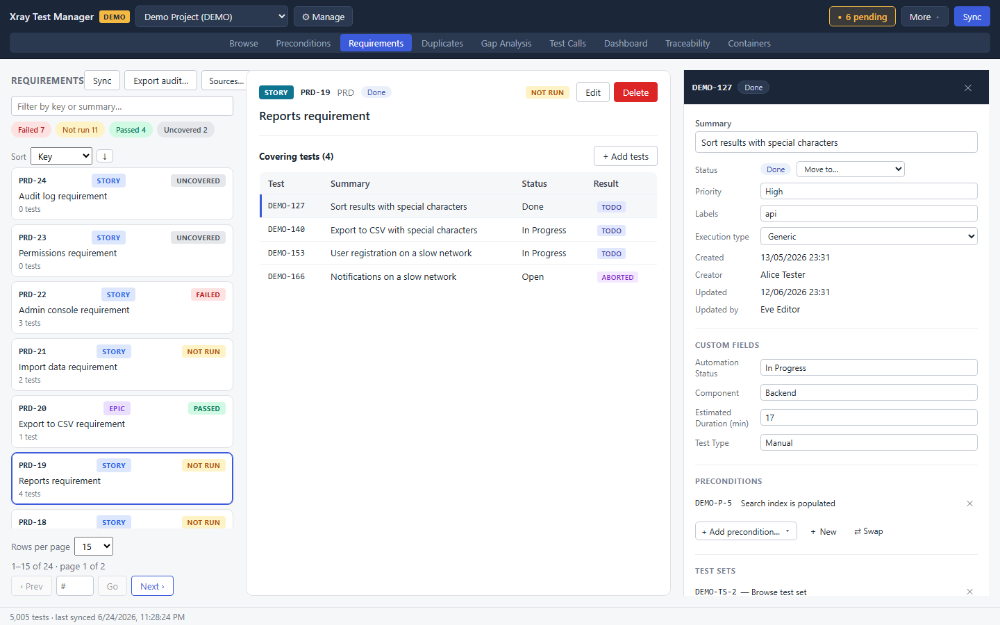
*Figure 53 — A covering test opened read-only in a side panel beside the
requirement detail.*

### Creating, importing & linking requirements

- **+ New requirement** drafts a requirement in a left-docked panel: pick the
  project and issue type and write a markdown summary. It gets a temporary key
  locally and is created in Jira on the next commit.
- **Import…** loads requirements from a CSV or XLSX file, de-duplicating by
  summary (like Gap Analysis) and offering a downloadable template.
- **Link…** relates the selected requirement to other requirements (for example
  **Requires**).
- **Link type.** Which Jira issue-link type connects a Test to a Requirement on
  commit is configurable in **Settings**. The default is **"Tested By"**, chosen
  from the link types your instance defines.

### Requirement sources

Requirements can come from projects other than your test project. Configure
which projects and issue types are pulled with **Sources…**:

*Figure 19 — The Requirement Sources dialog: add a source project, the issue
types to include, and an optional scope. Sync afterward to pull them in.*

---

## 10. Finding duplicates

The **Duplicates** tab surfaces likely-duplicate tests so you can consolidate
them. Results are grouped; each group lists its members with a detail panel.

*Figure 20 — Duplicate groups with a paginated list and a balanced detail panel
for the selected group.*

Use **Compare steps** to see members' steps **side by side**, with differing
rows highlighted — useful when deciding which copy to keep. **Compare summaries**
does the same for the members' summaries. Re-running the scan (**Scan**) shows a
progress bar in the status bar while it works.

*Figure 21 — Side-by-side step comparison across the duplicated tests
(**Compare summaries** offers the same view for summaries).*

---

## 11. Test Sets, Plans & Executions (Containers)

The **Containers** tab manages the three Xray container types. Pick a **kind**
(Test Set / Test Plan / Test Execution), then choose a container from a
**type-to-filter dropdown** that you can narrow by keyword, status, and — for
executions — Standalone vs Sub-task. A **Bugs** toggle at the top of the tab
switches to the defect view (see [Defect tracking](#defect-tracking)).

*Figure 22 — The Containers view: kind selector, container list, and member
tests. Tables default to 15 rows per page.*

You can:

- **Create** a container and allocate tests to it.
- Add or remove member tests.
- For a **Test Execution**, set each member's **run result** inline (e.g. PASS /
  FAIL / TODO), or apply one result to many selected members at once. A compact
  bar summarizes the run-status mix.

*Figure 23 — Each member's run result shows in the Execution column (PASS /
FAIL / TODO / ABORTED / EXECUTING), summarized by the bar above. In a Test
Execution these are editable inline, and one result can be applied to many
selected tests at once.*

**Sub-task Test Executions.** Xray lets a Test Execution be a *sub-task* of a
parent issue (often a Story). These sync and appear in the same execution list
as standalone ones; the **Standalone / Sub-task** filter narrows to either kind,
sub-task entries are tinted in the picker, and the selected execution's card
shows a **↳ parent** link that opens the parent issue in the browser. They use
all the same run-result and create-bug features.

**Test Environments & Fix Version(s).** A Test Execution's detail shows its Xray
**Test Environments** as chips you can edit — add or remove an environment on the
selected execution, or apply environments to several executions at once — and the
execution list can be filtered to a chosen environment. The execution's Jira
**Fix Version(s)** appear alongside as read-only chips. Both standalone and
sub-task executions are covered.

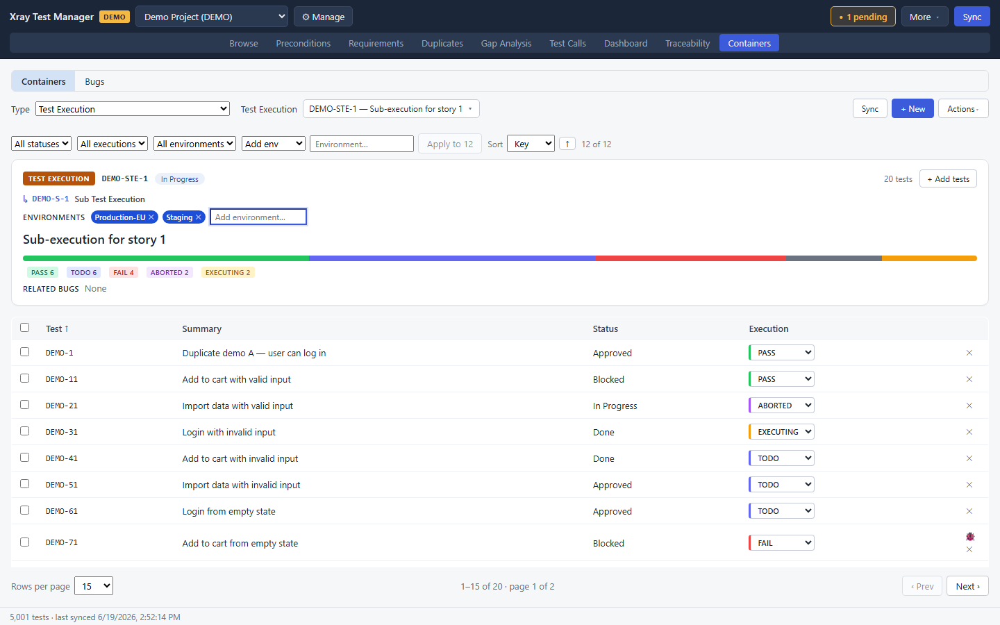
*Figure 41 — A sub-task Test Execution showing its editable Test Environments
chips and the batch environment controls. (Fix Version(s) render as read-only
chips when the execution has them.)*

**Cross-project members.** A Test Execution can include member tests that live in
a *different* Jira project. These are cached locally and shown on the board with
their run results just like in-project members, and their linked bugs are
harvested into the [Bugs panel](#defect-tracking) and the test detail. The
[Traceability](#traceability) Execution flow can include or exclude them with
the **include cross-project members** toggle.

**Run details on executions.** A Test Execution's member table also shows, per
test, the run **Date**, the **tester**, and the **environment** the run used,
beside the editable run-result control.

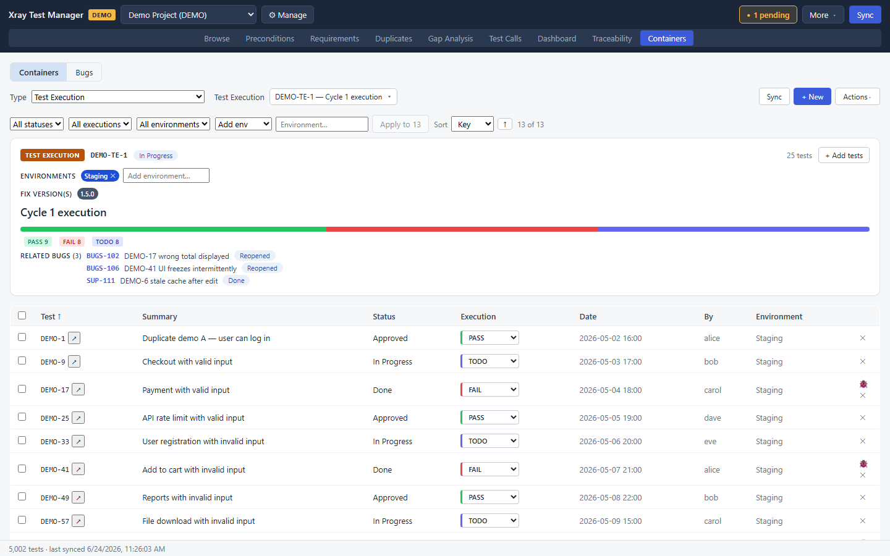
*Figure 43 — A Test Execution's members with run date, tester, and environment
columns alongside the editable result.*

**Plan / Set run roll-up.** Selecting a Test Plan or Test Set shows a **run
roll-up** bar above the board: passed / failed / not-run / executing / aborted /
blocked counts across the executions that ran its tests.

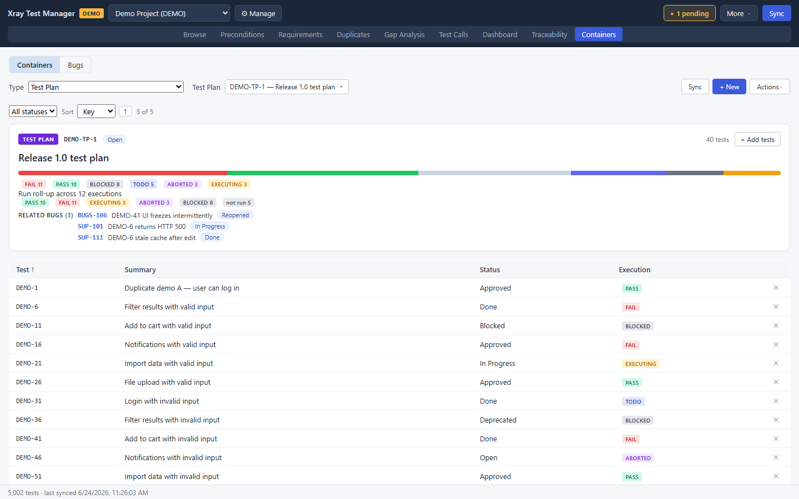
*Figure 44 — The run roll-up on a Test Plan, summarizing results across its
executions.*

**Open a test read-only.** The open-detail icon on a member test opens that
test's **read-only** detail in a side panel beside the board (the same panel the
Bugs view uses, see [Defect tracking](#defect-tracking)), so you can read its
steps and fields without leaving Containers.

**Per-test Fix Version filter.** Each member of a Test Execution shows its **own**
Jira Fix Version(s) in a **Fix Version** column (members can differ from one
another). The execution's Fix Version chips are clickable: select one to filter
the member list to the tests carrying it, and click it again (or **All**) to
clear.

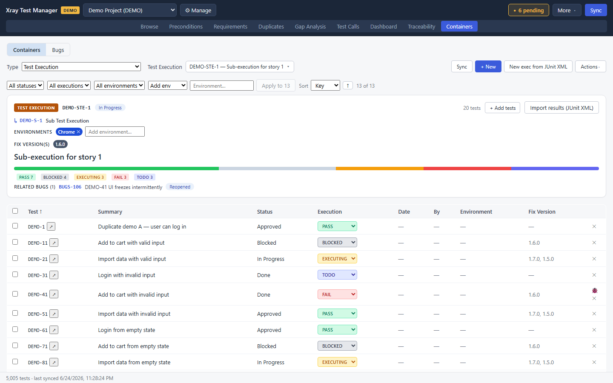
*Figure 52 — A Test Execution's member table with the per-test **Fix Version**
column and the run-status results highlighted in full colour.*

**Defects and remarks on a run.** Each member of a Test Execution also has
**Defects** and **Remarks** columns for recording notes on that specific run:

- **Link a defect.** Click the **＋** in the Defects column to open a picker.
  Search the cached bug list by key or summary, or type a bug key directly
  (e.g. `PROJECT-123`) and confirm to link it even if it is not yet cached
  locally. Linked defects show as removable chips; click a chip's **✕** to
  unlink it from the run.
- **Add or edit a remark.** Click into the Remarks cell and type; the remark
  saves when you press **Enter** or move focus away (on blur).

Both actions are staged as local pending changes, just like the run-status
control, and are pushed to Jira/Xray when you **Commit** (a run-defect link
and a run-comment update).

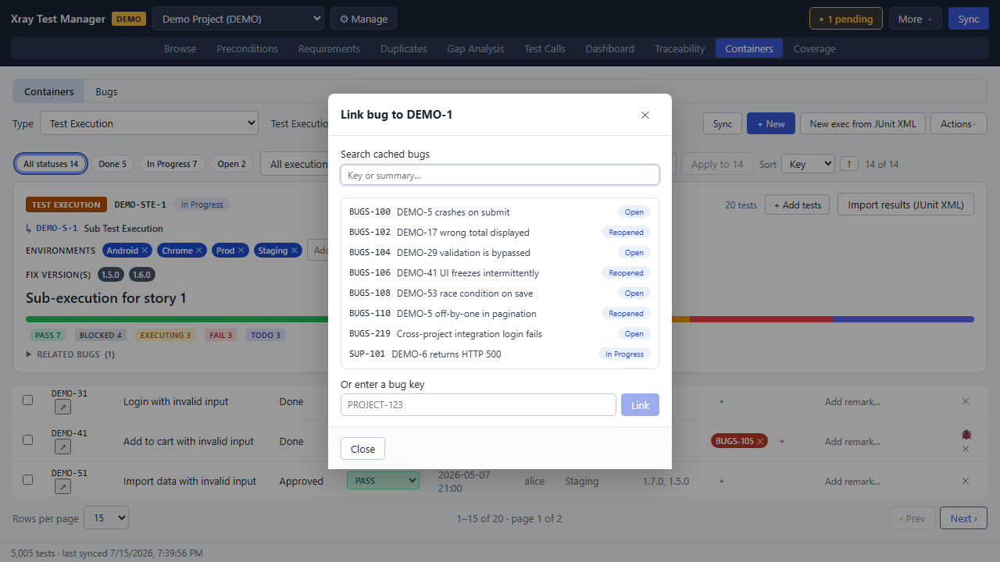
*Figure 55 — A Test Execution's member table with the **Defects** column (linked
bug chips and the ＋ picker) and the editable **Remarks** column.*

### Import JUnit XML results

You can update run results in bulk by importing a **JUnit-compatible XML** report.
Each `<testcase name>` is matched to a test by its **summary** (normalized), and
the result maps as: no failure/error → **PASS**, a `<failure>`/`<error>` →
**FAIL**, a `<skipped>` is left unchanged. Two entry points on the Test Execution
view:

- **Import results (JUnit XML)** updates the **selected** execution. Matched
  member tests get the imported result; unmatched or ambiguous testcases are
  reported and skipped.
- **New exec from JUnit XML** **creates a new Test Execution** from the report:
  enter the execution summary, optionally tick **Create missing tests** (any
  testcase with no matching test is created first), then pick the file. All tests
  are allocated to the new execution and given their results.

Either way the work is queued as pending changes and a preview shows what will be
applied before you commit. See [Committing changes](#committing-changes-to-jira).

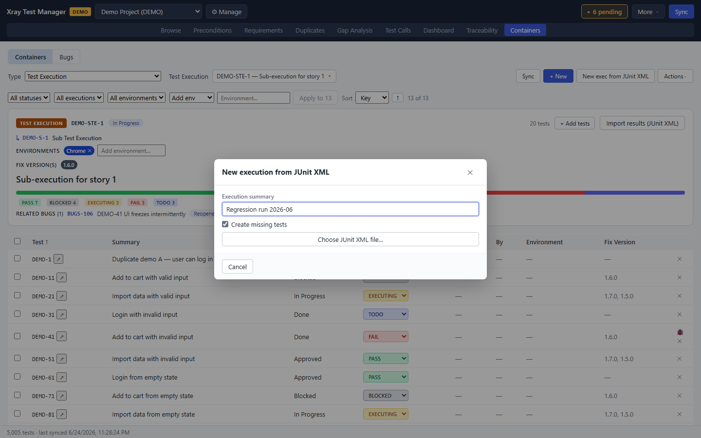
*Figure 50 — The "New execution from JUnit XML" dialog: an execution summary, the
**Create missing tests** option, and the file picker.*

### Generate a pytest scaffold

From a Test Plan or Execution you can generate a **pytest** scaffold for its
tests — either plain `@pytest.mark.xray` functions or a `unittest`-style class.

*Figure 24 — The Generate pytest menu and the resulting scaffold file.*

---

## 12. Defect tracking

When a test fails you can raise and track a defect (bug) for it without leaving
the app. Defect tracking spans three places:

- **Create a bug from a failed run.** In a Test Execution, a failed member row
  shows a **🐞** action that opens a create-bug form (summary, description,
  priority, labels). The bug is queued as a pending change, filed in Jira on the
  next commit, and linked to the test.
- **The Bugs panel.** The **Bugs** toggle at the top of the Containers tab lists
  every defect linked to this profile's tests — a paginated master list on the
  left and, for the selected bug, its details plus the affected tests (with their
  run status) on the right. Bug keys open in the browser; test keys open the
  test.
- **Linked bugs on a test.** A test's detail panel shows its linked bugs,
  including ones filed in a different project, as clickable keys.

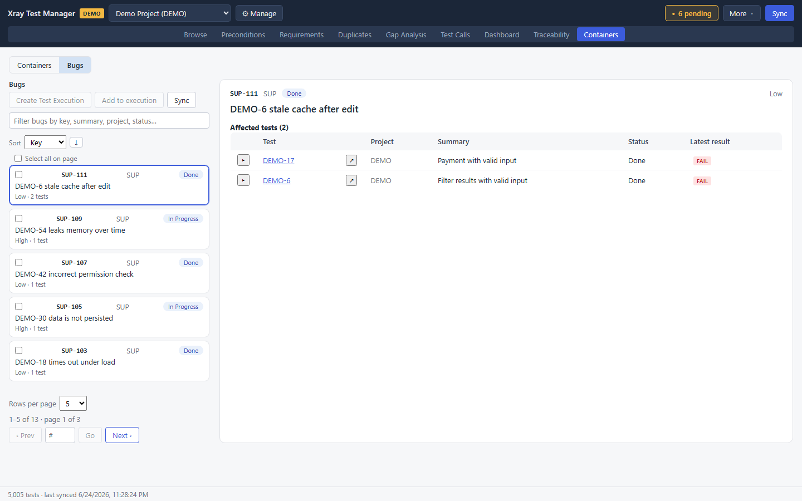
*Figure 37 — The Bugs panel (Containers → Bugs): linked defects with the selected
bug's details and the tests it affects.*

Which Jira project a new bug lands in, and its issue type, are configurable per
profile (the test project, the execution's project, or a dedicated defect
project). Bug sync respects the profile's scope and shows progress in the status
bar.

**Affected-tests breakdown.** The affected-tests table shows each test's
**Project**, and each row expands to a per-test run breakdown — execution,
result, fix version, environment, date, tester, **Created / Updated**, and
defects — drawn from the test's run history, so you can see how each affected
test fared without opening Xray. The runs are **grouped by Test Plan** (a plan
can span several executions and fix versions), and the run rows **sort** by
result, Created, or Updated.

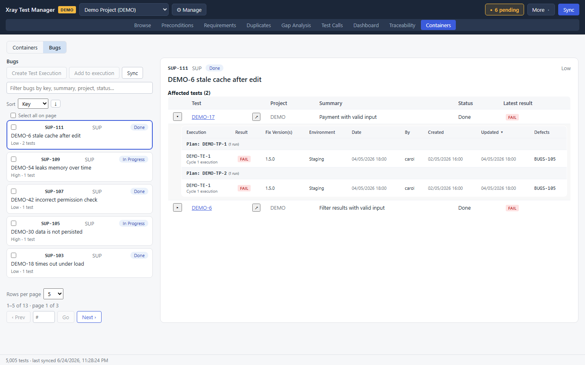
*Figure 45 — A bug's affected tests with the Project column and the expanded
per-test run breakdown grouped by Test Plan, with Created / Updated columns.*

**Open a test read-only.** The open-detail icon on an affected test opens that
test's **read-only** detail in a side panel beside the bug detail, mirroring the
Duplicates description/steps panel — so you can inspect its steps and fields
without leaving the Bugs view. The test key still opens the test in Browse, and
your Bugs selection and filters are restored when you return.

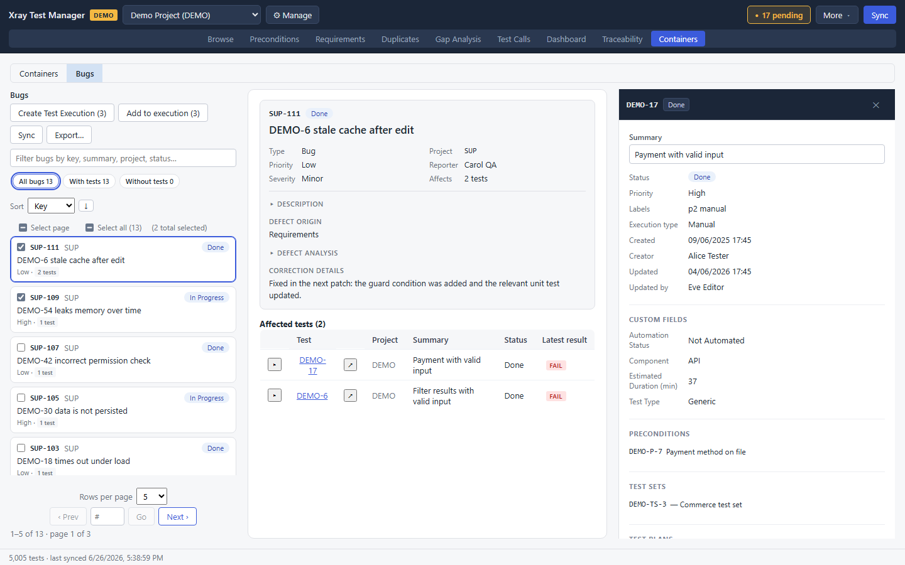
*Figure 46 — The read-only test detail opened to the right of the bug detail.*

**Add affected tests to an execution.** Alongside **Create Test Execution**
(which builds a new execution from the checked bugs' tests), **Add to
execution…** allocates those tests to an **existing** Test Execution picked from
a searchable list.

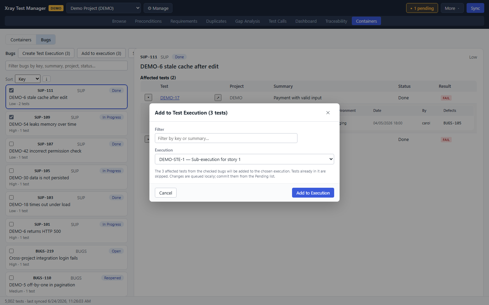
*Figure 47 — Adding the checked bugs' affected tests to an existing Test
Execution.*

---

## 13. Dashboard

The **Dashboard** tab summarizes the cached project from the local cache: total
tests, pending changes, and breakdowns by status, priority, folder, label,
component, and **requirement**, plus execution coverage, requirement coverage,
a **By requirement** chart beside By component, Test Set / Plan /
Execution counts, a duplicates card, and a recently-updated trend. Filter the
whole dashboard by **folder**, **component**, and **status** to scope every card
to a slice of the project. **Refresh** recomputes it from the cache without a
sync, and **Export XLSX** writes a workbook with a summary sheet plus one sheet
per breakdown (honouring the active filters). The traceability diagrams live in
their own [Traceability](#traceability) tab.

*Figure 25 — The statistics dashboard with summary cards and breakdowns.*

---

## 14. Traceability

The **Traceability** tab holds three Sankey diagrams behind a tab bar; each keeps
its own filters and only one shows at a time. Hover any node to trace its
threads.

- **Execution** (default) — flows **Test Plan → Test Execution → run status**.
  The plan and execution filters are multi-select (the execution list narrows to
  the chosen plans), and a **Cross-project only** toggle keeps just the runs
  whose Test Execution lives in a *different* Jira project than the current
  profile; while it's on, a **cross-project bugs** list appears beside the
  diagram.
- **Requirement** — flows **Requirement → Epic → Coverage → Test plan → Test →
  Test result** (the covering test case is shown explicitly), with a multi-select
  requirement filter. The **Epic** layer appears when a requirement has an epic
  and is skipped otherwise, falling back to the direct Requirement → Coverage
  flow.
- **Sub-task** — flows **Parent issue → Test Execution → run result** over
  sub-task Test Executions, with a **Parent** filter (each parent is shown as
  *key — summary*). Use it to see, per parent
  issue, which sub-task executions ran its tests and how they turned out.

Each tab's toolbar offers **Export XLSX**, which writes the current diagram as a
flow sheet plus a flat table of the same data. The **include cross-project
members** toggle controls whether member tests that live in other Jira projects
are drawn in the flow.

*Figure 27 — The Execution tab: Test Plan → Test Execution → run status.*

*Figure 26 — The Requirement tab: requirement → coverage → Test plan → test →
run result. The **Test** column shows the covering test case between its plan and
its result.*

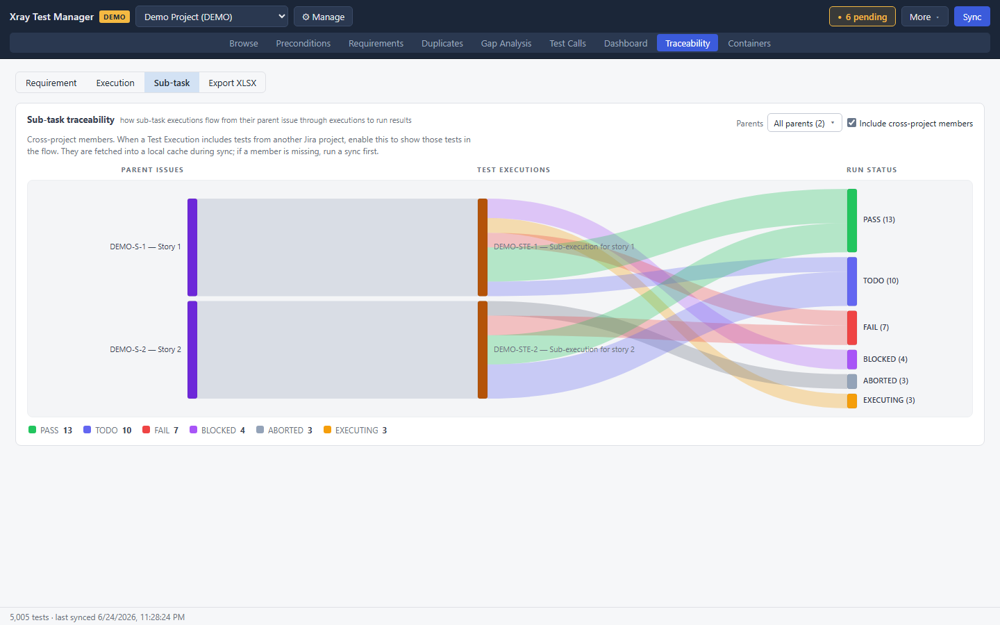
*Figure 38 — The Sub-task tab: parent issue (key — summary) → execution → run
result, with the
Parent filter.*

---

## 15. Gap analysis

The **Gap Analysis** tab compares two sets of tests and reports what each one is
missing, so coverage gaps — between two projects, or between a spreadsheet and a
project — are easy to spot.

Set up the comparison at the top of the tab:

- **Reference** — the baseline to compare against: the **active project** (its
  cached tests) or an **uploaded** CSV / XLSX file.
- **Target** — the CSV / XLSX file to check against the reference.
- **Compare by** — match tests by **summary**, or by **summary + folder** (which
  also flags tests that match by summary but sit in a different folder).
- **Three-way** (file reference only) — also compare both files against the
  active project, for a complete-project view.
- **Download template** — get a ready-made CSV / XLSX template (full, summary, or
  summary + folder) to fill in as the reference or target.

Click **Run analysis** to produce the result.

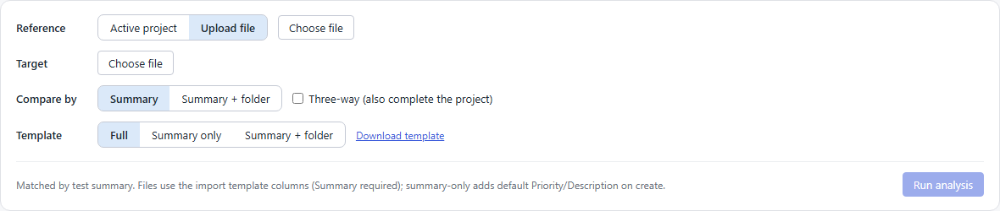
*Figure 39 — The Gap Analysis tab: choose the reference and target, the match
mode, and run.*

The result shows summary cards (**Matched**, **Orphaned in reference**, **Orphaned
in target**, **Total gap**) plus two lists:

- **Target → Reference** — tests in the target that are missing from the
  reference. These are addable: tick the ones you want and **Add selected as
  tests** to create them as pending new tests (commit them later from the Pending
  list).
- **Reference → Target** — tests in the reference that are missing from the target
  (report only).
- **Export CSV** / **Export Excel** writes a formatted report with a section per
  list (plus the folder mismatches, when comparing by summary + folder).

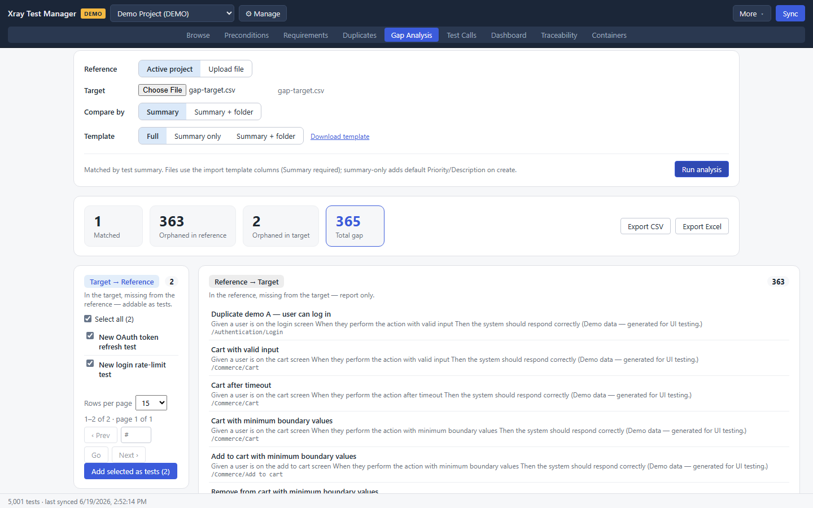
*Figure 40 — Gap Analysis results: the summary cards, the Target → Reference list
(addable) and Reference → Target list (report only), with the export actions.*

---

## 16. Coverage module

The **Coverage** tab is an opt-in, local-only workspace for **parameter-level
test coverage** and **cross-project functional-requirement reuse**. It is hidden
by default; turn it on with **More → Show Coverage tab**.

Requirement coverage (section 9) answers "does a test cover this Jira
requirement". The Coverage module goes further: it measures how thoroughly a
*function* is tested by breaking it into the parameter **values** that must be
exercised, and it lets you define that once and reuse it across many customer
projects. Everything is stored in the local cache, and nothing here needs Jira
admin.

### Functions, parameters, and values

- Define a **functional requirement** (a function under test) and decompose it
  into **parameter groups** and **parameter values** (valid values, error codes,
  and boundaries).
- Map your existing Tests to each value. Coverage is the share of **required
  values that have at least one mapped test** (the parameter-level definition,
  not an exhaustive combinatorial one).
- Values with no test are **gaps**; a mapping whose Test was later deleted is
  flagged **stale** and kept, never removed automatically.

### Reuse across projects

- Group equivalent requirement issues from many customer projects under one
  local **canonical functional requirement**, so coverage is defined once and
  reused. The module shows which projects reuse each requirement.

### Versions and change requests

- A functional requirement can hold multiple **versions** (for example 2.40 and
  3.0); coverage is measured per version, and a version can be **cloned** to
  start a new line.
- Customer requirements are **locked to a version**, and **change requests**
  record each customer's accept, reject, or pending decision, with
  version-distribution and adoption dashboards.

### Coverage Map

- The **Coverage Map** sub-tab (open it without picking a function) relates your
  in-scope projects to the canonical requirements: a per-project coverage panel
  (coverage percentage, requirement count, functions reused) and a **Sankey**
  flowing from project to function to covered or gap.
- The in-scope projects are **configuration** (a per-profile source and customer
  list) that seeds itself from your existing members.

### Seeding and export

- **Import** the PKCS#11 parameter-extraction Excel workbook to seed a model, or
  create a profile with the Jira URL **`demo-pkcs`** for a fully populated
  example across every view.
- **Export** a styled Excel report with Summary, per-group, Gaps, By-project,
  and Reuse-map sheets for Jira or Confluence.

---

## 17. Committing changes to Jira

All edits — field changes, steps, transitions, links, bugs, new entities,
deletions — are queued locally as **pending changes**. Nothing reaches Jira
until you commit.

The **pending badge** in the top bar shows the count. Click it to review:

*Figure 28 — The Pending Changes dialog: review each queued edit, discard
individual ones (or **Discard all** to revert everything), jump to the affected
test, **Commit** everything, or commit a selected subset.*

On **Commit**, the app pushes changes to Jira grouped by test. Results are
reported per test:

- **Succeeded** — applied; the pending rows are cleared.
- **Failed** — kept so you can retry or discard.
- **Conflict** — the test changed in Jira since your edit was based on it. The
  test is held back so you can **sync**, then either **override** (re-base your
  edit onto the latest remote) or **keep remote** (discard your local edit).
  Conflicts surface in this same dialog with the override / keep-remote actions.

---

## 18. Syncing

**Sync** pulls the latest tests from Jira into the local cache. The status bar
shows progress per phase (tests, folders, preconditions, containers,
requirements, bugs, custom fields).

*Figure 30 — A sync in progress, with the phase and item counts in the status
bar.*

> **Profile switching is locked during a sync.** While any sync is running (a
> full sync or a per-view refresh), the profile selector in the top bar is
> disabled, so you can't switch projects mid-pull and race the in-flight writes.
> It re-enables automatically as soon as the sync finishes.

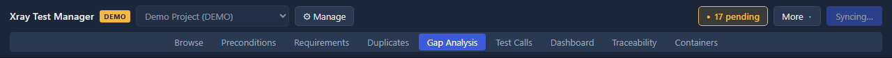
*Figure 54 — During a sync the profile selector is greyed out and the **Sync**
button reads "Syncing…"; switching profiles is blocked until it completes.*

- **Sync** (top-right) — incremental pull since the last watermark.
- **More → Full resync (re-pull folders)** — ignores the watermark and re-maps
  Test Repository folder membership. Slower; use after big folder reshuffles.
- **More → Sync history** — past syncs with timing and counts.

**Per-view refresh.** You don't always need a full sync. Some views refresh just
their own data:

- **Requirements → Sync** — pulls only requirement coverage from Jira.
- **Containers → Sync** — pulls only Test Sets / Plans / Executions.
- **Containers → Bugs → Sync** — pulls only the defects linked to your tests.
- **Dashboard → Refresh** — recomputes the dashboard from the local cache.
- **Duplicates → Scan** — re-scans the cache for duplicates.

These per-view syncs now show their progress in the status bar, the same as a
full sync.

*Figure 31 — The paginated sync history.*

---

## 19. Settings & profile management

The **Profile** menu (top-left) manages the active profile:

- **Set as default** — auto-select this profile at launch.
- **Edit profile…** — name, URL, project key, scope.
- **Set scope…** — a JQL scope that narrows which tests sync (blank = all).
- **Set token…** — set or rotate the PAT.
- **Export profile…** / **Import profile…** — share a profile's config (without
  its token).
- **New profile…**

*Figure 32 — The Profile menu.*

Switch the **color theme** from **More → Theme: Light / Dark / System**.

*Figure 33 — The app in dark theme.*

---

## 20. Diagnostics & troubleshooting

**More → Diagnostics** shows the database path, log path, schema version, and
environment details — useful when reporting an issue.

*Figure 34 — The Diagnostics dialog.*

| Symptom | What to try |
| --- | --- |
| Blank window on launch | Install the Microsoft WebView2 runtime, relaunch. |
| "Backend failed to start" | Note the DB/log path shown, check the log; try removing the database file and relaunching. |
| Sync shows 0 tests | Check the project key and that the PAT has access; confirm the scope JQL isn't excluding everything. |
| Edits not in Jira | They are local until you **Commit** (see §17). Check the pending badge. |
| A commit reports **Conflict** | Sync, then override or keep-remote in the Pending Changes dialog. |
| Token rejected | Rotate it with **Profile → Set token…**. |

**About** (native menu / **More**) shows the version.

*Figure 35 — The About dialog with the version number.*

---

## Glossary

- **PAT** — Personal Access Token; how the app authenticates to Jira DC.
- **Pending change** — a local edit queued in the app, not yet in Jira.
- **Commit** — push all (or selected) pending changes to Jira.
- **Sync** — pull the latest from Jira into the local cache.
- **Coverage** — a requirement's status derived from its covering tests' results
  (Passed / Failed / Not run / Uncovered).
- **Container** — a Test Set, Test Plan, or Test Execution.
- **Run result** — a test's status within a Test Execution (e.g. PASS/FAIL/TODO).
- **Demo profile** — a profile with Jira URL `demo`; runs fully offline on
  generated data.

---

*This guide is distributed with Xray Test Manager. Screenshots are captured from
a demo profile; your data and exact field set may differ by Jira/Xray
configuration.*

---

<!-- Include directive (docfilter.lua): a block-quote that is exactly one link
     to a readable file is replaced in place by that file's parsed content.
     Keep this as the sole content of the block-quote. -->

> [Screenshot capture guide](references/SCREENSHOTS.md)
